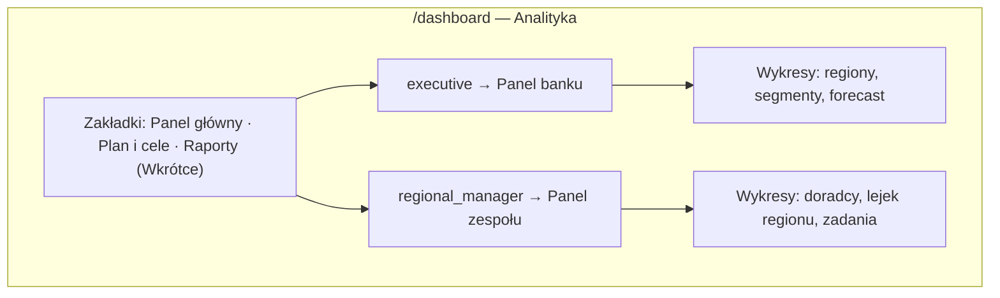

# Specyfikacja przebudowy widoków analityki per rola

**Status:** Stories utworzone — [US-36](./stories/US-36-analytics-role-aware-shell/story.md) … [US-40](./stories/US-40-analytics-multi-region-seed/story.md)  
**Data:** 2026-06-10  
**Źródło:** Potrzeba dopasowania modułu Analityka do **perspektywy menedżera regionalnego** (zespół) i **członka zarządu** (cały bank)  
**Cel:** Jedna specyfikacja pod kolejne user stories i taski w [`stories/`](./stories/README.md). **Na tym etapie tylko dokumentacja — bez implementacji.**

**Baseline:** [US-20](./stories/US-20-analytics-workspace/story.md) **Done** — wspólna przestrzeń `/dashboard` z dwoma presetami paneli, zakładką Plan i cele oraz 10 widżetami operacyjnymi.  
**Powiązane:** [US-07](./stories/US-07-executive-dashboard/story.md) (KPI plan/forecast), [`uspacy-inspiration.md`](./uspacy-inspiration.md) §5–6, [`design-guide.md`](./design-guide.md), [shadcn Charts](https://ui.shadcn.com/charts/).

---

## Podsumowanie

| # | Obszar | Priorytet | Krótki opis |
| --- | --- | --- | --- |
| [1](#1-zasada-produktowa--dwie-perspektywy-jedna-trasa) | Architektura | P0 | Jedna trasa `/dashboard`, **domyślny układ i narracja zależne od roli** |
| [2](#2-menedżer-regionalny--widok-zespołu) | `regional_manager` | P0 | KPI zespołu, ranking doradców, lejek regionu, aktywność i ryzyka operacyjne |
| [3](#3-członek-zarządu--widok-banku) | `executive` | P0 | KPI banku, porównanie regionów/segmentów, forecast, portfel strategiczny |
| [4](#4-wykresy-shadcn--pełna-paleta) | Wizualizacje | P0 | Area · Bar · Line · Pie · Radar · Radial + tabele drill-down |
| [5](#5-wspólne-elementy-i-zakładki) | Shell modułu | P1 | Filtry per rola, zakładki, hero KPI, reuse US-20 |
| [6](#6-dane-seed-i-metodyki) | Backend demo | P0 | Źródła danych, agregacje, ewentualne rozszerzenie seedu |
| [7](#7-rbac-i-prezentacja) | Demo flow | P1 | Kto co widzi; ścieżki prezentacji dla Marka i Jana |

**Zasady nienaruszalne:**

- Trasa: **`/dashboard`** (sidebar „Analityka”) — bez osobnych URL per rola.
- Dane: seed JSON + `DemoDataContext` — bez bazy, bez Route Handlers BI.
- RBAC: `filterByScope` / `filterAnalyticsEntities` — menedżer widzi **region**, zarząd **bank-wide**.
- Wykresy: **shadcn `Chart`** + Recharts ([dokumentacja](https://ui.shadcn.com/charts/)); kolory `--chart-1`…`--chart-5`, akcent CA — **nie** paleta fioletowa Uspacy.
- Język UI: **pl-PL**; waluta: **PLN** (`formatCurrencyPln`).

---

## 1. Zasada produktowa — dwie perspektywy, jedna trasa

Obecnie (US-20) obie role widzą **ten sam** wybór presetów („Sprzedaż i lejek”, „Zespół i zadania”) z drobnymi różnicami RBAC (overlay „Ograniczony dostęp” na 2 widżetach). To niewystarczające na prezentację:

| Perspektywa | Użytkownik demo | Główna potrzeba | Pytanie biznesowe |
| --- | --- | --- | --- |
| **Zespół** | Marek Wiśniewski (`regional_manager`, Mazowsze) | Czy mój zespół dowozi plan? Kto wymaga wsparcia? | „Jak pracuje mój region i którzy doradcy odstają?” |
| **Organizacja** | Jan Zarząd (`executive`) | Czy bank realizuje cele? Gdzie są luki regionalne? | „Jak wygląda portfel CA BK i gdzie interweniować?” |

**Decyzja:** Po zalogowaniu na `/dashboard` użytkownik widzi **dedykowany domyślny panel** swojej roli. Presety i zakładki są **role-aware** — nie wspólna lista 2 presetów dla wszystkich.



---

## 2. Menedżer regionalny — widok zespołu

**Konto demo:** Marek Wiśniewski · **Zakres danych:** `regionId === "mazowsze"` (doradcy Anna, Piotr + ich leady, deale, zadania, spotkania).  
**Domyślna zakładka:** **Panel główny → „Mój zespół”** (zamiast obecnego „Sprzedaż i lejek”).

### 2.1 Nagłówek kontekstowy

Pod tytułem „Analityka” — **podtytuł roli**:

> *Region Mazowsze · zespół 2 doradców · okres: bieżący kwartał*

(Wartości dynamiczne z `users.json` + filtr okresu.)

### 2.2 Pasek filtrów (menedżer)

| Filtr | Opcje | Domyślnie | Wpływ |
| --- | --- | --- | --- |
| **Okres** | bieżący miesiąc · bieżący kwartał · YTD | kwartał | Wszystkie agregacje operacyjne |
| **Doradca** | Wszyscy · Anna Kowalska · Piotr Nowak | Wszyscy | Zawężenie do `ownerId` w regionie |
| **Widok panelu** | Mój zespół · Sprzedaż i lejek · Aktywność operacyjna | **Mój zespół** | Zestaw widżetów w siatce |

Brak filtru **Region** (menedżer ma jeden region). Brak filtru **Segment** na panelu operacyjnym (segment = perspektywa zarządu).

### 2.3 Hero KPI — rząd 4 kart (1×1)

| KPI | Metryka | Źródło | Wizualizacja |
| --- | --- | --- | --- |
| Realizacja planu regionu | `actualQuarterPln / planQuarterPln` dla Mazowsze | `kpi.byRegion` | KPI + **Radial Chart** (mini, w karcie) — procent realizacji |
| Wygrane deale (kwota) | suma `amount` dealów `won` w okresie | `deals` scoped | KPI PLN + sparkline trend (3 m-ce) |
| Otwarty lejek (kwota) | suma `amount` dealów nie terminalnych | `deals` scoped | KPI PLN |
| Zadania po terminie (zespół) | count zadań `dueDate < today` ∧ ¬done | `tasks` scoped | KPI + badge „wymaga uwagi” gdy > 0 |

**Wzorzec shadcn:** [Radial Chart](https://ui.shadcn.com/charts/radial) w karcie realizacji planu; pozostałe KPI — reuse `AnalyticsKpiVisual` / `KpiCard` z opcjonalnym `AnalyticsMiniSparkline`.

### 2.4 Siatka widżetów — preset „Mój zespół” (domyślny)

Układ docelowy (grid 12 kolumn, jak US-20):

| Poz. | Widżet | Typ shadcn | Rozmiar | Opis |
| --- | --- | --- | --- | --- |
| A | **Wyniki doradców — kwota wygranych** | **Bar Chart** (pionowy, grouped) | 2×1 | Słupki: Anna vs Piotr — wygrane PLN w okresie; druga seria: plan indywidualny (derived z `kpi` lub stały udział 50/50 demo) |
| B | **Lejek dealów regionu** | **Bar Chart** (poziomy) | 2×1 | Etapy lejka kredytowego (`DEAL_FUNNEL_STAGES`) — reuse logiki `deal-funnel`, pełna wysokość shadcn |
| C | **Aktywność zespołu w czasie** | **Area Chart** (stacked) | 2×1 | Oś X: tygodnie/miesiące; serie: nowe leady, wygrane deale, zamknięte zadania — stacked area per zespół |
| D | **Profil doradców** | **Radar Chart** | 2×2 | Wymiary: Leady · Otwarte deale · Wygrane · Zadania zamknięte · Spotkania; po 1 polygonie na doradcę |
| E | **Zadania po terminie wg opiekuna** | **Bar Chart** (pionowy) | 2×1 | Reuse `overdue-tasks-by-owner` — **bez overlay restricted** (to core widok menedżera) |
| F | **Konwersja lead → deal** | **Line Chart** | 2×1 | % leadów `won` / wszystkich zamkniętych w okresie; linia trendu regionu |
| G | **Ranking zespołu** | **Tabela** | 2×2 | Patrz [§2.6](#26-tabele--menedżer-regionalny) |
| H | **Zadania wg priorytetu** | **Bar Chart** (stacked) | 2×1 | Reuse `tasks-by-priority`; opcjonalnie drill per doradca przy filtrze |

**Widżety do usunięcia / ukrycia dla menedżera:**

- `won-amount-by-source` — **bez overlay** albo **ukryty** (strategiczny mix kanałów = perspektywa zarządu).
- `avg-deal-duration` — **widoczny** (menedżer ocenia tempo zamykania).

### 2.5 Presety alternatywne (menedżer)

| Preset | Widżety | Kiedy używać na demo |
| --- | --- | --- |
| **Mój zespół** | A–H powyżej | Główna narracja Marka po wejściu w Analitykę |
| **Sprzedaż i lejek** | KPI hero + lejek + otwarte/wygrane + avg deal value + konwersja | Skupienie na pipeline bez rankingu |
| **Aktywność operacyjna** | Zadania po terminie · wg priorytetu · spotkania · area aktywności | Follow-up operacyjny zespołu |

### 2.6 Tabele — menedżer regionalny

#### Tabela 1: Ranking doradców (widżet G)

| Kolumna | Opis |
| --- | --- |
| Doradca | `displayName` + avatar/inicjały |
| Wygrane (PLN) | suma w okresie |
| Otwarte deale | count + kwota |
| Nowe leady | count w okresie |
| Zadania po terminie | count (kolor destructive gdy > 0) |
| Spotkania | count w okresie (`meetings.json`) |
| Realizacja planu | % (derived) |
| Trend | mini sparkline 6 tyg. wygranych |

Sortowanie domyślne: **Wygrane (PLN) malejąco**. Wiersz klikalny → filtr „Doradca” (bez nawigacji poza moduł).

#### Tabela 2: Deale wymagające uwagi (opcjonalny widżet 2×1, preset Aktywność)

| Kolumna | Opis |
| --- | --- |
| Deal | tytuł + link `/pipeline/[id]` |
| Opiekun | doradca |
| Etap | badge statusu lejka |
| Kwota | PLN |
| Dni w etapie | derived z `updatedAt` |
| Powód | „Zadanie po terminie powiązane” / „Brak aktywności > 14 dni” |

Max 5 wierszy + link „Zobacz wszystkie w Deale”.

---

## 3. Członek zarządu — widok banku

**Konto demo:** Jan Zarząd · **Zakres danych:** bank-wide (`filterByScope` bez ograniczenia regionu).  
**Domyślna zakładka:** **Panel główny → „Portfel banku”**.

### 3.1 Nagłówek kontekstowy

> *Credit Agricole Bank Polska · 3 regiony · okres: YTD*

### 3.2 Pasek filtrów (zarząd)

| Filtr | Opcje | Domyślnie | Wpływ |
| --- | --- | --- | --- |
| **Okres** | kwartał · YTD · bieżący miesiąc | **YTD** | Agregacje operacyjne + KPI |
| **Region** | Wszystkie · Mazowsze · Małopolska · Pomorze | Wszystkie | Zawężenie do jednego regionu (drill-down) |
| **Segment** | Wszystkie · MŚP · Duże przedsiębiorstwo | Wszystkie | Filtr po `client.segmentId` / KPI segment |
| **Widok panelu** | Portfel banku · Regiony · Produkty i lejki | **Portfel banku** | Preset widżetów |

Brak filtru **Doradca** na domyślnym widoku zarządu (operacje per doradca = delegacja do menedżera). Opcjonalnie w filtrach zaawansowanych (nice to have).

### 3.3 Hero KPI — rząd 4 kart (1×1)

| KPI | Metryka | Źródło |
| --- | --- | --- |
| Plan YTD | `kpi.planYtdPln` | `kpi.json` |
| Realizacja YTD | `kpi.actualYtdPln` + **Radial Chart** % | `kpi.json` |
| Forecast YTD (bazowy) | `kpi.forecastYtdPln` | `kpi.json` |
| Otwarty pipeline (bank) | suma kwot dealów nie terminalnych | `deals` scoped |

Trzecia karta może pokazywać **pasmo scenariuszy** (optymistyczny / pesymistyczny) jako subtelny tekst pod KPI.

### 3.4 Siatka widżetów — preset „Portfel banku” (domyślny)

| Poz. | Widżet | Typ shadcn | Rozmiar | Opis |
| --- | --- | --- | --- | --- |
| A | **Plan vs realizacja vs forecast** | **Area Chart** (multi-series) | 2×2 | Oś X: `kpi.monthlyTrend.monthLabel`; serie: plan, realizacja, forecast bazowy; gradient fill — wzór [Area Chart – Interactive](https://ui.shadcn.com/charts/area) |
| B | **Realizacja wg regionu** | **Bar Chart** (grouped) | 2×1 | 3 regiony × (plan, realizacja) — kluczowy wykres porównawczy zarządu |
| C | **Udział segmentów w realizacji** | **Pie Chart** (donut) | 1×2 | MŚP vs Enterprise — udział % `actualPln`; center label: suma YTD |
| D | **Scenariusze forecastu** | **Line Chart** (multi-line) | 2×1 | Miesięczny trend: bazowy, optymistyczny, pesymistyczny |
| E | **Portfel produktowy — wygrane wg kategorii** | **Bar Chart** (stacked) | 2×1 | Kategorie lejków (`pcat-credit`, `pcat-leasing`, …) — suma PLN won |
| F | **Lejek bank-wide (kredyt)** | **Bar Chart** (poziomy) | 2×1 | Agregat etapów — bank-wide lub po filtrze regionu |
| G | **Macierz regionów** | **Radar Chart** | 2×2 | 3 regiony; osie: Realizacja planu · Pipeline · Konwersja leadów · Aktywność · Nowi klienci |
| H | **Scorecard regionów** | **Tabela** | 2×2 | Patrz [§3.6](#36-tabele--członek-zarządu) |
| I | **Kwota wygranych wg źródła** | **Bar Chart** (pionowy) | 2×1 | Reuse `won-amount-by-source` — **pełny dostęp** dla executive |
| J | **Nowe leady vs wygrane deale** | **Line Chart** (dual axis lub 2 serie) | 2×1 | Trend miesięczny bank-wide — wolumen na górze lejka |

### 3.5 Presety alternatywne (zarząd)

| Preset | Widżet | Narracja demo |
| --- | --- | --- |
| **Portfel banku** | A–J | Jan: „Jak idzie bank?” — start po loginie |
| **Regiony** | B, G, H + realizacja planu radial per region + tabela scorecard | Porównanie Mazowsze / Małopolska / Pomorze |
| **Produkty i lejki** | E, F, I + KPI pipeline + avg deal value | Mix produktowy i lejek kredytowy |

### 3.6 Tabele — członek zarządu

#### Tabela 1: Scorecard regionów (widżet H)

| Kolumna | Opis |
| --- | --- |
| Region | `regionName` |
| Plan (PLN) | YTD lub wybrany okres |
| Realizacja (PLN) | actual |
| Realizacja (%) | z **Radial** mini inline lub progress bar |
| Forecast (PLN) | bazowy |
| Luka do planu | plan − actual |
| Otwarte deale | count + kwota |
| Trend 6 m-cy | sparkline realizacji |

Wiersz klikalny → ustawia filtr **Region** i zawęża wykresy.

#### Tabela 2: Top 10 dealów otwartych (widżet opcjonalny 2×1)

| Kolumna | Opis |
| --- | --- |
| Deal | tytuł |
| Firma | klient |
| Region | badge |
| Kwota | PLN |
| Etap | status lejka |
| Opiekun | doradca |
| Przewidywane zamknięcie | `expectedCloseDate` |

Sort: kwota malejąco. Link do karty deala.

#### Tabela 3: Realizacja wg segmentu (w zakładce Plan i cele lub preset Regiony)

| Segment | Plan | Realizacja | % | Forecast |
| --- | --- | --- | --- | --- |
| MŚP | … | … | … | … |
| Duże przedsiębiorstwo | … | … | … | … |

---

## 4. Wykresy shadcn — pełna paleta

Wszystkie wykresy implementować przez istniejący [`components/ui/chart.tsx`](../components/ui/chart.tsx): `ChartContainer`, `ChartTooltip`, `ChartTooltipContent`, `ChartLegend`, `ChartLegendContent`, `ChartConfig`.

### 4.1 Mapowanie typów → use case

| Typ ([shadcn Charts](https://ui.shadcn.com/charts/)) | Menedżer regionalny | Członek zarządu | Uwagi implementacyjne |
| --- | --- | --- | --- |
| **Area Chart** | Aktywność zespołu w czasie (stacked) | Plan vs realizacja vs forecast (gradient) | `Area`, `AreaChart`; `stackId` dla stacked |
| **Bar Chart** | Wyniki doradców; lejek; zadania | Realizacja regionów; produkty; źródła | Vertical + horizontal; grouped + stacked |
| **Line Chart** | Konwersja lead → deal | Scenariusze forecastu; leady vs deale | `Line`, `LineChart`; `type="monotone"` |
| **Pie Chart** | — | Udział segmentów (donut) | `Pie`, `PieChart`, `innerRadius` dla donut |
| **Radar Chart** | Profil doradców (2 serie) | Macierz regionów (3 serie) | `Radar`, `RadarChart`, `PolarGrid` |
| **Radial Chart** | Realizacja planu regionu (hero KPI) | Realizacja YTD banku (hero KPI) | `RadialBarChart` w małej karcie KPI |
| **Composed Chart** | — | Opcjonalnie w Plan i cele (reuse US-07) | Bar + Line na jednym wykresie |

### 4.2 Standard wizualny wykresów

- **Kolory:** wyłącznie `var(--chart-1)` … `var(--chart-5)` + `var(--primary)` dla akcentu; serie w `ChartConfig` z etykietami PL.
- **Oś Y (PLN):** skrót `mln` / `tys.` — reuse `formatAxisPln` z `executive-dashboard.tsx`.
- **Tooltip:** `ChartTooltipContent` z formatowaniem PLN i procentów.
- **Legenda:** pod wykresem dla ≥ 2 serii; dla wykresu poziomego — badges pod słupkami (wzorzec `deal-funnel-widget.tsx`).
- **Empty state:** reuse `AnalyticsWidgetEmpty`.
- **Skeleton:** reuse puls z US-20 (300 ms przy zmianie filtrów).
- **Responsywność:** `min-h-*` + `aspect-auto` w `ChartContainer`; grid zwija 2×2 → 1×1 na mobile.

### 4.3 Interakcje (demo)

| Interakcja | Zachowanie |
| --- | --- |
| Klik wiersza tabeli regionu / doradcy | Ustawia filtr globalny (region / doradca) |
| Klik segmentu pie | Toggle filtr segmentu (zarząd) |
| Hover wykresu | Tooltip shadcn — bez osobnego modala |
| Drill do modułu CRM | Link „Zobacz w Deale / Leady” pod tabelą — **poza** wykresem |

Brak pełnego cross-filtering BI — wystarczy filtr globalny + klik w tabelę.

---

## 5. Wspólne elementy i zakładki

### 5.1 Struktura modułu (bez zmiany trasy)

```
/dashboard
├── Nagłówek: Analityka + podtytuł roli
├── Tabs
│   ├── Panel główny     ← role-specific presets + siatka widżetów
│   ├── Plan i cele      ← ExecutiveDashboard (rozszerzony o filtry spójne z panelem)
│   └── Raporty          ← disabled + badge „Wkrótce”
└── Filtry globalne      ← zestaw zależny od roli (§2.2 / §3.2)
```

### 5.2 Zakładka „Plan i cele”

- **Zarząd:** obecny `ExecutiveDashboard` — filtry region/segment/YTD; wykres **Composed Chart** (plan + realizacja + forecast) — już jest.
- **Menedżer:** ten sam komponent z **zablokowanym regionem** (Mazowsze) i ukrytym selectem regionu; widoczne KPI planu **tylko swojego regionu**.
- Rozszerzenie: pod wykresem — **tabela segmentów** (§3.6 T3) dla zarządu.

### 5.3 Ramka widżetu

Reuse `AnalyticsWidget`:

- Tytuł PL
- Tag domeny: Leady · Deale · Zadania · Plan · Zespół · Regiony
- Menu ⋮ (stub „Etap 1”)
- Uchwyt DnD (`@dnd-kit`) — kolejność w sesji
- **Usunąć** sens overlay „Ograniczony dostęp” tam, gdzie widżet jest **dedykowany** roli (np. ranking doradców tylko menedżer; scorecard regionów tylko zarząd). Zamiast tego: widżet **w ogóle nie renderowany** dla niewłaściwej roli.

### 5.4 Reuse z US-20

| Istniejący element | Decyzja |
| --- | --- |
| `lib/analytics/metrics.ts` | Rozszerzyć o agregacje: per region, per segment, per advisor, trendy tygodniowe |
| `lib/analytics/widget-registry.ts` | Podzielić presety na `EXECUTIVE_PANEL_PRESETS` i `MANAGER_PANEL_PRESETS` |
| `AnalyticsPanelGrid` | Bez zmiany kontraktu — nowe `widgetIds` |
| KPI count widgets | Reuse w hero row |
| `deal-funnel-widget` | Reuse — pełny shadcn bar |
| `won-amount-by-source-widget` | Tylko executive |
| `overdue-tasks-by-owner-widget` | Priorytet menedżera |

---

## 6. Dane, seed i metodyki

### 6.1 Źródła danych

| Źródło | Pola kluczowe | Użycie |
| --- | --- | --- |
| `data/kpi.json` | plan, actual, forecast, `byRegion`, `bySegment`, `monthlyTrend` | Hero KPI, wykresy planu, scorecard |
| `data/deals.json` | `amount`, `status`, `ownerId`, `regionId`, `source`, `productId`, `pipelineCategoryId`, daty | Lejek, pipeline, produkty, źródła |
| `data/leads.json` | `status`, `ownerId`, `regionId`, `createdAt` | Konwersja, trendy |
| `data/tasks.json` | `priority`, `ownerId`, `dueDate`, `status` | Zadania po terminie, priorytety |
| `data/meetings.json` | `ownerId`, `regionId`, `startAt` | Aktywność zespołu, ranking |
| `data/clients.json` | `segmentId`, `regionId` | Filtr segmentu, agregacje |
| `data/users.json` | `role`, `regionId` | Doradcy w regionie menedżera |

### 6.2 Nowe / rozszerzone agregacje (`lib/analytics/`)

| Klucz metryki | Opis |
| --- | --- |
| `advisor_won_amount_rows` | `{ ownerId, ownerName, amountPln, planPln? }[]` |
| `region_scorecard_rows` | join `kpi.byRegion` + operacyjne deale/leady |
| `team_activity_timeline` | tygodnie × { leads, dealsWon, tasksDone, meetings } |
| `advisor_radar_rows` | znormalizowane 0–100 per wymiar |
| `region_radar_rows` | jw. per region |
| `segment_share_rows` | udział % realizacji |
| `product_category_won_rows` | suma PLN per `pipelineCategoryId` |
| `lead_conversion_trend` | % per miesiąc |
| `top_open_deals_rows` | top N po kwocie |

### 6.3 Ewentualne rozszerzenie seedu (implementacja)

| Potrzeba | Propozycja | Priorytet |
| --- | --- | --- |
| Deale w Małopolskie / Pomorze | Dodać po kilka rekordów z `regionId` ≠ mazowsze i innymi `ownerId` (wirtualni doradcy lub reuse z opisem) | P1 — inaczej wykres regionów opiera się głównie na `kpi.json`, operacyjne wykresy będą puste |
| Plan per doradca | Pole w seedzie lub prosty split planu regionu / liczba doradców | P2 — wystarczy na demo |
| Spotkania per doradca w czasie | Już jest w `meetings.json` — wykorzystać | — |

**Demo bez rozszerzenia seedu:** wykresy **regionów** i **segmentów** opierają się na `kpi.json`; wykresy **operacyjne per doradca** — na Anna + Piotr (Mazowsze). Na prezentacji zarząd i tak patrzy na KPI bankowe; menedżer — na zespół.

### 6.4 Data referencyjna

Bez zmian: `DEMO_REFERENCE_DATE` z `lib/analytics/filters.ts` — spójność okresów z resztą demo.

---

## 7. RBAC i prezentacja

### 7.1 Macierz dostępu

| Element | `executive` | `regional_manager` | `advisor` |
| --- | --- | --- | --- |
| Pozycja menu Analityka | ✓ | ✓ | ✗ |
| Domyślny preset | Portfel banku | Mój zespół | — |
| Filtr Region | ✓ | ✗ (implicit) | — |
| Filtr Segment | ✓ | ✗ | — |
| Filtr Doradca | opcjonalny | ✓ | — |
| Scorecard regionów | ✓ | ✗ | — |
| Ranking doradców | ✗ | ✓ | — |
| `won-amount-by-source` | ✓ | ✗ | — |
| Zakładka Plan i cele | bank-wide | region locked | — |

Implementacja: `getAnalyticsPresetsForRole(role)`, `getWidgetsForPreset(presetId, role)` — bez duplikacji strony.

### 7.2 Ścieżki prezentacji (§6 requirements)

**Jan Zarząd (executive):**

1. Login → `/dashboard` (start default)
2. Panel **Portfel banku** — Area plan/forecast, Bar regionów, Pie segmentów
3. Klik Mazowsze w scorecard → filtr regionu
4. Zakładka **Plan i cele** — scenariusze forecastu
5. Opcjonalnie preset **Produkty i lejki**

**Marek Wiśniewski (regional_manager):**

1. Login → `/pipeline` (start default) → sidebar **Analityka**
2. Panel **Mój zespół** — Radar doradców, ranking, zadania po terminie
3. Filtr **Anna Kowalska** — zawężenie wykresów
4. Preset **Aktywność operacyjna** — follow-up zespołu
5. Zakładka **Plan i cele** — realizacja Mazowsze

---

## 8. Mapowanie na user stories

| Story | Zakres | Taski |
| --- | --- | --- |
| [US-36](./stories/US-36-analytics-role-aware-shell/story.md) — shell per rola | Presety, filtry, podtytuł, hero KPI, Plan i cele | T-36-01 … T-36-06 |
| [US-39](./stories/US-39-analytics-shadcn-charts/story.md) — biblioteka wykresów | Area, Line, Pie, Radar, Radial | T-39-01 … T-39-05 |
| [US-40](./stories/US-40-analytics-multi-region-seed/story.md) — seed multi-region | Doradcy + deale/leady/zadania poza Mazowszem | T-40-01, T-40-02 |
| [US-37](./stories/US-37-analytics-regional-manager/story.md) — panel menedżera | Preset „Mój zespół”, ranking, radar, tabele | T-37-01 … T-37-06 |
| [US-38](./stories/US-38-analytics-executive/story.md) — panel zarządu | Preset „Portfel banku”, regiony, segmenty, forecast | T-38-01 … T-38-07 |

**Kolejność implementacji:** US-40 → US-39 → US-36 → US-37 ∥ US-38

---

## 9. Poza zakresem

- Eksport PDF/Excel, zapis layoutu na dysk.
- Zakładka **Raporty** (pozostaje „Wkrótce”).
- Osobna rola „analityk BI”.
- Prawdziwy silnik OLAP, Route Handlers, baza danych.
- Widżety ML / prognozy AI.
- Gamifikacja rankingu (odznaki, confetti).

---

## 10. Kryteria akceptacji (całość specyfikacji)

Po implementacji wszystkich powiązanych story:

- [ ] Login jako **Jan** → domyślny panel **Portfel banku** z ≥ 4 typami wykresów shadcn (Area, Bar, Pie, Line/Radar).
- [ ] Login jako **Marek** → domyślny panel **Mój zespół** z rankingiem doradców i wykresem Radar.
- [ ] **Radial Chart** w hero KPI realizacji planu (obie role, inna skala: region vs bank).
- [ ] ≥ 1 **tabela** drill-down per rola (scorecard / ranking).
- [ ] Filtry globalne **różne** per rola; zmiana filtra odświeża wykresy.
- [ ] Wszystkie wykresy przez `ChartContainer` + tokeny `--chart-*`.
- [ ] Brak regresji zakładki **Plan i cele** i nawigacji `/dashboard`.
- [ ] `npm run dev` — prezentacja §6 requirements bez błędów.

---

## 11. Otwarte pytania

| # | Pytanie | Propozycja domyślna |
| --- | --- | --- |
| 1 | Czy rozszerzać seed dealów/leadów o Małopolskę i Pomorze? | **Tak (P1)** — min. 3–5 rekordów per region dla wiarygodności wykresów operacyjnych |
| 2 | Plan per doradca — seed czy split? | **Split równy** planu regionu / N doradców — wystarczy na demo |
| 3 | Czy executive widzi ranking doradców (read-only)? | **Nie** na głównym panelu — delegacja do menedżera; ewentualnie po filtrze regionu w preset „Regiony” |
| 4 | Osobne komponenty chart vs parametryzowany `AnalyticsChart`? | **Osobne pliki** per typ (czytelność, copy-paste ze shadcn docs) + cienki wrapper na `ChartConfig` |
| 5 | Zakładka Raporty — kiedy? | Poza tą specyfikacją; backlog `demo-expansion.md` |

---

## 12. Referencje

| Temat | Plik / URL |
| --- | --- |
| Obecna analityka | [US-20 story](./stories/US-20-analytics-workspace/story.md) |
| KPI plan/forecast | [US-07 story](./stories/US-07-executive-dashboard/story.md), `data/kpi.json` |
| shadcn Charts | https://ui.shadcn.com/charts/ |
| Design tokens | [`design-guide.md`](./design-guide.md) |
| RBAC scope | `lib/rbac/scope.ts`, `lib/analytics/scope.ts` |
| Persony demo | [`uspacy-inspiration.md`](./uspacy-inspiration.md) §4–6 |
