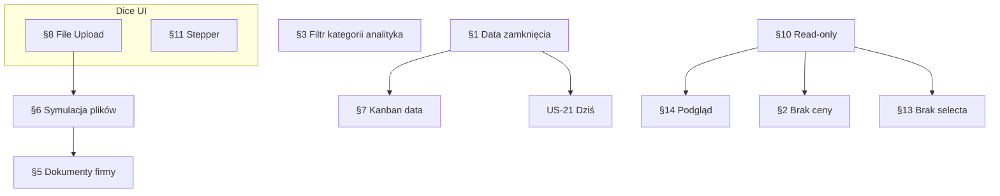

# Specyfikacja zmian — iteracja 2 (feedback po demo)

**Status:** In story — [US-41 … US-47](./stories/README.md#kolejność-implementacji)  
**Data:** 2026-06-12  
**Źródło:** Uwagi po przeglądzie demo Etap 1 (spotkanie / test prezentacyjny)  
**Baseline:** US-01 … US-40 **Done** — patrz [`progress-tracker.md`](./progress-tracker.md).

---

## Podsumowanie

| # | Obszar | Priorytet | Krótki opis |
| --- | --- | --- | --- |
| [1](#1-planowana-data-zamknięcia-deala) | Deale | P0 | Pole `expectedCloseDate` w UI, edycja, wskaźniki terminu, integracja z „Dziś” |
| [2](#2-produkty--usunięcie-ceny) | Produkty | P1 | Cena nieistotna w banku — ukryć z UI i filtrów |
| [3](#3-analityka--filtr-kategorii-produktowych) | Analityka | P0 | Globalny filtr kategorii produktowych (menedżer + zarząd) |
| [4](#4-firma--nazwa-zakładki-i-zadania) | Firma | P1 | Zmiana nazwy zakładki; dodać zadania powiązane z firmą |
| [5](#5-firma--dodawanie-dokumentu) | Firma | P0 | Naprawa dodawania dokumentu na karcie firmy |
| [6](#6-symulacja-uploadu-plików) | Pliki / dokumenty | P0 | Działający upload demo + lista plików we wszystkich miejscach |
| [7](#7-kanban-deala--data-zamknięcia-zamiast-utworzenia) | Deale / Kanban | P1 | Na karcie kanbanu: planowana data zamknięcia zamiast `createdAt` |
| [8](#8-komponent-file-upload--dice-ui) | Komponenty | P0 | `@diceui/file-upload` — bez dodatkowego stylizowania |
| [9](#9-analityka--usunięcie-menu-widżetu) | Analityka | P2 | Usunąć ikonę „…” sugerującą menu na kartach widżetów |
| [10](#10-produkty--tylko-odczyt--sync-demo) | Produkty | P0 | Brak CRUD; losowa notyfikacja o synchronizacji z systemów bankowych |
| [11](#11-stepper-statusu-na-karcie-leada-deala) | Lead · Deal | P1 | Dice UI Stepper zamiast obecnego paska statusu |
| [12](#12-zadania--kolumna-szansa) | Zadania | P2 | Wyjaśnienie i uporządkowanie kolumny „Szansa” |
| [13](#13-produkty--usunięcie-selecta-w-tabeli) | Produkty | P1 | Checkbox / select wiersza w tabeli produktów — zbędny |
| [14](#14-produkty--podgląd-bez-edycji) | Produkty | P0 | Szczegóły produktu read-only (bez formularza edycji) |

**Zasady nienaruszalne:**

- Dane: seed JSON + `DemoDataContext` — bez bazy i bez prawdziwego uploadu na serwer.
- RBAC: `filterByScope` / `canAccessEntity`.
- Design CA: [`design-guide.md`](./design-guide.md) — komponenty Dice UI bez kopiowania 1:1 cudzego layoutu (wyjątek: file-upload **bez** dodatkowego stylizowania — patrz §8).
- Prezentacja: po wdrożeniu zaktualizować [`requirements.md`](./requirements.md) §6.

---

## Stan wyjściowy (baseline)

| Temat | Co jest dziś | Pliki / uwagi |
| --- | --- | --- |
| `expectedCloseDate` | Pole w typie `Deal` i seedzie `data/opportunities.json`; używane w `/today`, bannerze, powiadomieniach | **Brak** w formularzu deala, sidebarze karty, liście dealów, kanbanie |
| Upload plików | `CompanyFilesUploadZone` — toast „Etap 2”, brak zapisu | `components/crm/company-files-upload-zone.tsx` |
| Dokumenty (nazwane) | `addClientDocument` / `addDealDocument` / `addLeadDocument` w Context | Zakładka „Dokumenty” na firmie — formularz nazwy; **znany bug:** `addClientDocument` wymaga `user.regionId` — użytkownik **executive** (`regionId: null`) nie może dodać dokumentu |
| Karta firmy | Zakładka **„Powiązane jednostki”** (Leady, Deale) | `components/crm/company-detail-view.tsx` — regresja względem spec US-35 (planowany layout bez tej zakładki) |
| Produkty | CRUD, kolumna Cena, checkbox select, formularz edycji na `/products/[id]` | `products-table.tsx`, `product-detail-view.tsx`, `product-form.tsx` |
| Analityka — filtry | Okres, preset, doradca (menedżer), region/segment (zarząd) | `analytics-filters-bar.tsx`, `AnalyticsGlobalFilters` — **brak** `pipelineCategoryId` |
| Analityka — menu widżetu | Przycisk `MoreHorizontalIcon` (disabled, tooltip „Etap 1”) | `components/crm/analytics-widget.tsx` |
| Status leada/deala | Własne komponenty `LeadStatusBar`, `DealStatusBar` (grid przycisków) | `lead-status-bar.tsx`, `deal-status-bar.tsx` |
| Zadania — „Szansa” | Kolumna `opportunityTitle` — powiązanie z dealem (`Task.opportunityId`) | `tasks-columns.tsx`, `task-form-dialog.tsx` — legacy nazewnictwo „szansa” = **deal** |

---

## 1. Planowana data zamknięcia deala

### Problem

W bankowości korporacyjnej **przewidywana data zamknięcia deala** jest kluczowym polem operacyjnym. W demo pole `expectedCloseDate` istnieje w modelu i seedzie, ale **nie jest widoczne ani edytowalne** w głównych widokach dealów. Doradca nie może go ustawić przy tworzeniu deala ani przesunąć na karcie. Kanban i lista nie sygnalizują zbliżających się ani przekroczonych terminów.

### Cel biznesowy

Umożliwić planowanie i monitoring terminów zamknięcia deali — spójnie z widokiem „Dziś”, powiadomieniami (US-22) i bannerem (US-23), które już korzystają z `expectedCloseDate`.

### Zakres (demo)

**W zakresie:**

- **Etykieta PL:** „Planowana data zamknięcia” (lub „Przewidywana data zamknięcia” — jedna etykieta w całej aplikacji).
- **Formularz nowego deala** (`DealForm`): pole daty (date picker lub `input type="date"`), walidacja opcjonalna (P1: wymagane dla deali otwartych).
- **Karta deala** (`deal-detail-sidebar`): inline edycja daty (`InlineEditableField` lub date picker), zapis przez `updateDeal`.
- **Zmiana daty** rejestrowana w timeline deala (aktywność systemowa, np. `deal_expected_close_changed`).
- **Lista dealów:** kolumna „Planowana data zamknięcia”; opcjonalnie sortowanie domyślne po terminie (P2 — nie blocker).
- **Kanban i lista — wskaźniki terminu** (tylko deale **otwarte**, tj. statusy workflow — **nie** `won` / `lost`):
  - **Zbliżający się termin:** żółta ikona (np. `AlertTriangle` / `Clock`) + tooltip PL, np. „Termin zamknięcia za X dni (DD.MM.RRRR)”.
  - **Po terminie:** czerwona ikona (np. `AlertCircle`) + tooltip PL, np. „Przekroczono planowaną datę zamknięcia (DD.MM.RRRR)”.
  - Progi demo (propozycja — stałe w `lib/crm/deal-close-date-urgency.ts`):
    - `approaching`: od dziś do **dziś + 7 dni** włącznie (spójne z `TODAY_PIPELINE_HORIZON_DAYS` w US-21);
    - `overdue`: data &lt; dziś (`getToday()` z [`lib/crm/local-date.ts`](../lib/crm/local-date.ts)).
  - Deale bez `expectedCloseDate`: brak ikony.
- **Widok „Dziś”:** bez zmian logiki selekcji (już oparta o `expectedCloseDate`) — zweryfikować, że nowe/edytowane daty natychmiast wpływają na listę.

**Poza zakresem:**

- Automatyczne przesuwanie terminu przy zmianie etapu lejka.
- Przypomnienia e-mail / kalendarz.
- Osobne pole „rzeczywista data zamknięcia” — `finishedAt` przy `won`/`lost` zostaje.

### UI / UX

- Ikony terminu: dyskretne, obok nazwy deala lub w wierszu metadanych karty kanbanu — nie zasłaniać drag handle.
- Tooltip z pełną datą w `pl-PL`.
- Edycja daty na karcie: klik → picker → zapis on blur / Enter.

### Dane

- Pole: `Deal.expectedCloseDate?: string` (ISO date `YYYY-MM-DD`) — bez zmian typu.
- Seed: otwarte deale z terminami wokół bieżącej daty (bez zamrożonej daty demo).
- Helper: `getDealCloseDateUrgency(deal, asOfDate)` → `'none' | 'approaching' | 'overdue'`.

### Kryteria akceptacji (szkic)

- [ ] Doradca ustawia planowaną datę zamknięcia przy tworzeniu deala i edytuje ją na karcie.
- [ ] Lista i kanban pokazują żółtą / czerwoną ikonę z tooltipem dla otwartych deali spełniających progi; deale `won`/`lost` — bez ikon.
- [ ] `/today` i powiadomienia nadal działają po edycji terminu.
- [ ] Zmiana daty widoczna w timeline deala.

---

## 2. Produkty — usunięcie ceny

### Problem

W banku ceny produktów korporacyjnych są **niedocjowane** — prezentacja kolumny „Cena” wprowadza w błąd.

### Zakres

**W zakresie:**

- Usunąć kolumnę **Cena** z tabeli produktów (`products-columns.tsx`).
- Usunąć pole **Cena** i powiązane **Rodzaj ceny** (`priceKind`) z formularza / podglądu produktu (patrz też §14).
- Usunąć filtr faceted **Rodzaj ceny** z listy produktów.
- Usunąć `formatProductPrice` z widoku listy (helper może zostać w lib na przyszłość lub zostać usunięty jeśli martwy).

**Poza zakresem:**

- Usuwanie pól `price` / `priceKind` z typu `Product` i seedu (mogą zostać w JSON dla przyszłych integracji; nie wyświetlać).

### Kryteria akceptacji

- [ ] Żaden widok produktów w UI nie pokazuje ceny ani filtra po cenie.

---

## 3. Analityka — filtr kategorii produktowych

### Problem

Menedżer i zarząd analizują wyniki per **kategoria produktowa** (kredyt, faktoring, …), a globalny pasek filtrów tego nie oferuje — mimo że deale mają `pipelineCategoryId`.

### Zakres

**W zakresie:**

- Nowy filtr globalny w `AnalyticsFiltersBar`: **Kategoria produktowa** (Select lub faceted).
- Opcja **„Wszystkie kategorie”** (= brak filtra).
- Wartości z `DEAL_PIPELINE_CATEGORY_LABELS` / `deal-pipeline.ts` — te same ID co w kanbanie dealów (US-29).
- Rozszerzyć `AnalyticsGlobalFilters` o `pipelineCategoryId: string | null`.
- Propagacja filtra do `scopedDeals` / `scopedLeads` (gdzie dotyczy) w `lib/analytics/metrics.ts` — filtrowanie po `deal.pipelineCategoryId`.
- Widoczność: **`regional_manager`** i **`executive`** (doradca poza zakresem — ma wąski scope osobisty).
- Filtr współpracuje z istniejącymi: okres, doradca, region, segment.

**Poza zakresem:**

- Osobny filtr po pojedynczym produkcie (`productId`) — tylko kategoria.
- Zapisywanie filtra w URL.

### Kryteria akceptacji

- [ ] Menedżer i zarząd mogą zawęzić panel analityki do jednej kategorii produktowej.
- [ ] Wszystkie widżety na siatce respektują filtr kategorii (KPI, wykresy, tabele).

---

## 4. Firma — nazwa zakładki i zadania

### Problem

Zakładka **„Powiązane jednostki”** sugeruje strukturę organizacyjną banku, a zawiera **leady i deale**. Brakuje też widoku **zadań** powiązanych z firmą.

### Zakres

**W zakresie:**

- Zmiana nazwy zakładki na propozycję PO (do wyboru przy story):
  - **„Sprzedaż i relacje”** (rekomendowane), lub
  - **„Pipeline firmy”**, lub
  - **„Leady i deale”** (najbardziej dosłowne).
- Dodać podzakładkę **„Zadania”** obok Leady / Deale:
  - Lista zadań gdzie `task.clientId === client.id` (scope RBAC).
  - Link do karty zadania / szybka akcja „Nowe zadanie” z prefill `clientId` (reuse `TaskFormDialog`).
- Spójność z wskaźnikami engagement w sidebarze firmy — klik „Zadania” może przełączać na tę podzakładkę.

**Uwaga techniczna:** Spec US-35 zakładał usunięcie zakładki na rzecz layoutu 2-kolumnowego. Obecny kod ma regresję (zakładki wróciły). Przy implementacji **ustalić z PO**: (A) tylko rename + zadania w istniejącej zakładce, lub (B) pełny powrót do layoutu US-35 z listami w sidebarze / sekcjach bez zewnętrznych tabów. **Domyślna rekomendacja spec:** (A) minimalna zmiana nazwy + zadania — szybsza na demo.

**Poza zakresem:**

- Kontakty / historia w tej zakładce (kontakty są w sidebarze engagement).

### Kryteria akceptacji

- [ ] Zakładka nie nazywa się „Powiązane jednostki”.
- [ ] Użytkownik widzi zadania powiązane z firmą w dedykowanej podzakładce.

---

## 5. Firma — dodawanie dokumentu

### Problem

Dodawanie dokumentu na karcie firmy (zakładka **Dokumenty** — pole nazwy + przycisk) **nie działa** w niektórych scenariuszach demo.

### Diagnoza (baseline)

- `addClientDocument` w `demo-data-context.tsx` zwraca `null`, gdy `!user.regionId` — dotyczy roli **executive**.
- Zakładka **Pliki** używa `CompanyFilesUploadZone`, który **nie zapisuje** plików (tylko toast) — mylące względem **Dokumentów**.

### Zakres

**W zakresie:**

- Naprawa `addClientDocument` (i analogicznie `addDealDocument` / `addLeadDocument` jeśli ten sam wzorzec): `regionId` dokumentu = `user.regionId ?? client.regionId` (lub region encji nadrzędnej).
- Po nieudanym zapisie: `toast.error` z komunikatem PL (nie cisza).
- Po sukcesie: lista dokumentów odświeża się (już jest); wpis w timeline / feed firmy.
- Spójność z §6 dla zakładki **Pliki**.

### Kryteria akceptacji

- [ ] Doradca, menedżer i executive mogą dodać nazwany dokument na karcie firmy.
- [ ] Błąd jest widoczny użytkownikowi, gdy zapis się nie powiedzie.

---

## 6. Symulacja uploadu plików

### Problem

Wszystkie miejsca uploadu plików są niefunkcjonalne — użytkownik wybiera plik, ale **nie widzi go na liście** i nie ma spójnego UX.

### Miejsca w aplikacji (inwentaryzacja)

| Kontekst | Komponent | Zakładka / sekcja |
| --- | --- | --- |
| Firma | `company-activity-panel.tsx` | Pliki |
| Lead | `lead-activity-panel.tsx` | Pliki |
| Deal | `deal-activity-panel.tsx` | Pliki |
| Formularze aktywności | `*-activity-form.tsx` | Załączniki (jeśli są) |

### Zakres

**W zakresie:**

- Zastąpić `CompanyFilesUploadZone` wspólnym komponentem opartym o **Dice UI File Upload** (§8).
- **Symulacja demo:**
  1. Użytkownik wybiera / przeciąga plik(i).
  2. Krótki stan „przesyłania” (progress z API komponentu lub `onUpload` z opóźnieniem ~300–800 ms).
  3. Zapis metadanych w Context (nowy typ lub rozszerzenie dokumentów):
     - Propozycja: **`ClientFile` / `LeadFile` / `DealFile`** z polami: `id`, `{entityId}`, `fileName`, `fileSize`, `mimeType`, `uploadedAt`, `ownerId`, `regionId` — **bez** treści binarnej (demo).
     - Alternatywa: jeden typ `UploadedFile` z `entityType` + `entityId`.
  4. Lista dodanych plików pod strefą uploadu (nazwa, rozmiar, data, autor) + usuwanie pojedynczego pliku (P1).
- Akceptowane typy: PDF, obrazy, Office — komunikat PL przy odrzuceniu (walidacja `onFileValidate`).
- Limit demo: np. max 10 plików, max 5 MB — zgodnie z dokumentacją Dice UI.

**Poza zakresem:**

- Prawdziwy storage / base64 w localStorage.
- Podgląd treści PDF w modalu.

### Kryteria akceptacji

- [ ] We wszystkich kontekstach (firma, lead, deal) upload dodaje plik do listy widocznej w UI.
- [ ] Progress / stan przesyłania jest widoczny podczas symulacji.
- [ ] Zachowanie spójne między modułami (ten sam komponent bazowy).

---

## 7. Kanban deala — data zamknięcia zamiast utworzenia

### Problem

Na karcie kanbanu deala (`deal-kanban-card.tsx`) wyświetlana jest **data utworzenia** (`createdAt`). Dla doradcy istotniejsza jest **planowana data zamknięcia**.

### Zakres

**W zakresie:**

- Zamienić wyświetlanie `createdAt` na `expectedCloseDate` z fallbackiem:
  - Gdy data ustawiona: pokazać z tooltipem „Planowana data zamknięcia”.
  - Gdy brak: „Brak terminu” / em dash — bez ukrywania całego wiersza (P1).
- Ikony pilności z §1 na tej samej karcie (reuse helpera).

**Poza zakresem:**

- Usunięcie `createdAt` z modelu — nadal dostępne na karcie szczegółów / timeline.

### Kryteria akceptacji

- [ ] Karta kanbanu deala pokazuje planowaną datę zamknięcia zamiast daty utworzenia.

---

## 8. Komponent File Upload — Dice UI

### Wymaganie

Użyć oficjalnego komponentu shadcn registry:

```bash
npx shadcn@latest add @diceui/file-upload
```

Dokumentacja: [File Upload — Dice UI](https://www.diceui.com/docs/components/radix/file-upload)

### Zasady

- Import z `@/components/ui/file-upload` (po instalacji).
- **Bez dodatkowego stylizowania** poza tokenami projektu — nie tworzyć własnego „dropzone” CSS.
- Składnia: `FileUpload`, `FileUploadDropzone`, `FileUploadList`, `FileUploadItem`, … według layoutu z docs.
- Reuse: jeden wrapper `CrmFileUploadPanel` w `components/crm/` przyjmujący `onUpload` / `value` — używany w §6.
- Rejestr Dice UI: dopisać do [`reuse-and-conventions.md`](./reuse-and-conventions.md) po instalacji.

---

## 9. Analityka — usunięcie menu widżetu

### Problem

W prawym górnym rogu karty widżetu analityki (`analytics-widget.tsx`) jest ikona **trzech kropek** (`MoreHorizontalIcon`) — sugeruje menu kontekstowe, którego nie ma (przycisk disabled, tooltip „Etap 1”).

### Zakres

- Usunąć przycisk i tooltip w całości.
- Zachować uchwyt drag (`GripVerticalIcon`) do DnD siatki.
- Brak zastępstwa menu w Etapie 1.

### Kryteria akceptacji

- [ ] Karty widżetów nie mają ikony „…”.

---

## 10. Produkty — tylko odczyt + sync demo

### Problem

Produkty synchronizują się z systemów bankowych — **ręczne dodawanie i edycja** w CRM nie ma sensu w narracji demo.

### Zakres

**W zakresie:**

- Usunąć z UI `/products`:
  - przycisk **„Nowy produkt”** i `ProductFormDialog`;
  - akcje edycji / usuwania w tabeli (jeśli są);
  - nawigację do edycji — `/products/[id]` staje się **podglądem** (§14).
- `DemoDataContext`: metody `addProduct` / `updateProduct` — **nie wywoływać z UI** (mogą zostać w Context na potrzeby testów / przyszłości).
- **Notyfikacja synchronizacji (demo):**
  - Przy wejściu na `/products` (lub raz na sesję — `sessionStorage`): losowo **~30%** szans na pojawienie się powiadomienia in-app (reuse US-22 — dzwonek + lista):
    - Tytuł PL: „Katalog produktów zaktualizowany”
    - Treść: „Pobrano zmiany z systemu produktowego banku.”
    - Typ: informacyjny; bez nawigacji lub link do `/products`.
  - Implementacja: wpis w `lib/crm/notification-rules.ts` lub jednorazowy `addNotification` w `useEffect` strony produktów.

**Poza zakresem:**

- Prawdziwy polling / WebSocket.
- Historia wersji produktu.

### Kryteria akceptacji

- [ ] Użytkownik nie może utworzyć ani edytować produktu z UI.
- [ ] Okazjonalna notyfikacja o aktualizacji katalogu pojawia się zgodnie z regułą demo.

---

## 11. Stepper statusu na karcie leada / deala

### Problem

Obecny pasek statusu (`LeadStatusBar`, `DealStatusBar`) to siatka przycisków — mniej czytelny w prezentacji niż **stepper** pokazujący postęp w procesie.

### Zakres

**W zakresie:**

- Instalacja: `npx shadcn@latest add @diceui/stepper` → `components/ui/stepper.tsx`.
- Dokumentacja: [Stepper — Dice UI](https://www.diceui.com/docs/components/radix/stepper).
- **Lead:** kroki = statusy workflow leada (`new` → … → `won`/`lost`); aktywny krok = `lead.status`; kroki terminalne (`won`/`lost`) — osobny stan ukończenia (jak dziś).
- **Deal:** kroki = `getPipelineWorkflowSteps(pipelineCategoryId)`; aktywny = `deal.status`; `won`/`lost` — wynik końcowy.
- Zachować istniejącą logikę zmiany statusu (klik kroku / `onStatusChange`, walidacja przejść, przycisk „Zakończ przetwarzanie” / „Zakończ deal”).
- Orientacja: **pozioma** na desktopie (jak obecny bar); **vertical** opcjonalnie na wąskim viewporcie (P2).
- Dopasowanie do tokenów CA — bez kopiowania demo Dice UI 1:1, ale struktura Stepper z registry.

**Poza zakresem:**

- Stepper w kanbanie lub na liście.
- Walidacja formularza między krokami (lead/deal już mają własne dialogi finalizacji).

### Kryteria akceptacji

- [ ] Karta leada i deala używają Stepper do prezentacji etapu procesu.
- [ ] Zmiana statusu działa jak przed zmianą (bez regresji DnD / finalizacji).

---

## 12. Zadania — kolumna „Szansa”

### Wyjaśnienie (odpowiedź na pytanie PO)

Kolumna **„Szansa”** w tabeli zadań (`tasks-columns.tsx`) to **legacy nazwa** dla powiązania z **dealem**:

| Pole w modelu | Znaczenie dziś |
| --- | --- |
| `Task.opportunityId` | ID deala (`Deal.id` w `opportunities`) |
| `opportunityTitle` (derived) | Tytuł / nazwa deala do wyświetlenia |

Powiązanie jest **opcjonalne** — zadanie może być przypisane do firmy (`clientId`), deala (`opportunityId`) i/lub leada (`leadId`). W formularzu zadania pole „Szansa” to combobox dealów.

### Rekomendacja zmiany

**W zakresie (P2):**

- Zmienić etykietę kolumny i pola formularza: **„Szansa” → „Deal”** (lub „Powiązany deal”).
- W globalnej wyszukiwarce / copy: stopniowo wycofywać słowo „szansa” na rzecz „deal” (spójność z US-18).
- Tooltip w nagłówku kolumny (opcjonalnie): „Deal sprzedażowy powiązany z zadaniem”.

**Poza zakresem:**

- Zmiana nazwy pola `opportunityId` w typach / JSON (breaking; ewentualnie alias w UI tylko).

### Kryteria akceptacji

- [ ] Użytkownik widzi „Deal” zamiast „Szansa” w module zadań.
- [ ] Dokumentacja / spec potwierdza semantykę powiązania.

---

## 13. Produkty — usunięcie selecta w tabeli

### Problem

Tabela produktów ma kolumnę z **checkboxem** (row selection) — nieużywaną w żadnym flow demo.

### Zakres

- Usunąć kolumnę `select` z `products-columns.tsx`.
- Usunąć stan `selectedIds` i powiązane props z `products-table.tsx`.

### Kryteria akceptacji

- [ ] Tabela produktów nie ma checkboxów wyboru wiersza.

---

## 14. Produkty — podgląd bez edycji

### Problem

Strona `/products/[id]` renderuje `ProductForm` w trybie edycji — sprzeczne z §10.

### Zakres

**W zakresie:**

- Zastąpić formularz **widokiem read-only**:
  - Nazwa, SKU, kategoria, typ, dostępność, stan, opis — jako lista pól / `DescriptionList` (reuse wzorca z kart firmy/deala).
  - Bez `Input` / `Select` edytowalnych; brak przycisku „Zapisz”.
- Usunąć lub ukryć linki „Edytuj” w tabeli produktów.
- Klik wiersza nadal prowadzi do podglądu `/products/[id]`.

**Poza zakresem:**

- PDF / karta produktu do druku.

### Kryteria akceptacji

- [ ] Szczegóły produktu są tylko do odczytu.
- [ ] Spójne z §2 (brak ceny) i §10 (brak CRUD).

---

## Zależności między wymaganiami



| Wymaganie | Zależy od |
| --- | --- |
| §6 | §8 |
| §5 | §6 (dla zakładki Pliki); naprawa `regionId` niezależna |
| §7 | §1 (pole i helper pilności) |
| §14 | §10 |
| §2, §13 | §10 (jedna story produktów) |

---

## User stories (utworzone)

| Story | Zakres | Taski | Powiązane § |
| --- | --- | --- | --- |
| [US-41](./stories/US-41-deal-expected-close-date/story.md) | Planowana data zamknięcia deala | T-41-01 … T-41-05 | §1, §7 |
| [US-42](./stories/US-42-file-upload-dice-ui/story.md) | Upload plików Dice UI | T-42-01 … T-42-05 | §5, §6, §8 |
| [US-43](./stories/US-43-products-read-only/story.md) | Produkty read-only | T-43-01 … T-43-05 | §2, §10, §13, §14 |
| [US-44](./stories/US-44-analytics-category-filter/story.md) | Analityka — filtr i UX | T-44-01 … T-44-03 | §3, §9 |
| [US-45](./stories/US-45-company-tab-and-tasks/story.md) | Firma — zakładka i zadania | T-45-01 … T-45-02 | §4 |
| [US-46](./stories/US-46-lead-deal-stepper/story.md) | Stepper statusu lead/deal | T-46-01 … T-46-03 | §11 |
| [US-47](./stories/US-47-tasks-deal-column-rename/story.md) | Zadania — kolumna Deal | T-47-01 | §12 |

---

## Wpływ na prezentację (requirements §6)

Po wdrożeniu zaktualizować [`requirements.md`](./requirements.md):

1. **Deale:** pokazać planowaną datę zamknięcia, żółte/czerwone flagi na kanbanie, edycję terminu na karcie.
2. **Dziś:** narracja „deale wymagające uwagi” oparta o zbliżający się / przekroczony termin.
3. **Produkty:** katalog tylko do przeglądu; krótka wzmianka o synchronizacji z systemu bankowego (+ notyfikacja).
4. **Analityka (zarząd/menedżer):** filtrowanie panelu po kategorii produktowej.
5. **Firma:** poprawna nazwa zakładki pipeline; zadania firmy; działające pliki/dokumenty.
6. **Karty lead/deal:** stepper etapów zamiast paska przycisków.

---

## Dziennik

| Data | Autor | Wpis |
| --- | --- | --- |
| 2026-06-12 | PO + Agent | Utworzono specyfikację iteracji 2 (14 wymagań) na podstawie feedbacku po demo |
| 2026-06-12 | Agent | Utworzono US-41 … US-47 + 24 taski w `stories/` |
