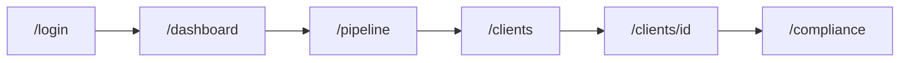
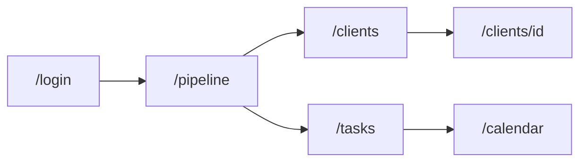
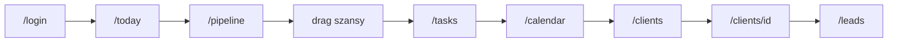

# Freshsales jako inspiracja — mapa ekranów CABPL CRM Demo

**Cel dokumentu:** konkretne mapowanie ekranów demo (Etap 1) na odpowiedniki w **Freshsales** (Freshworks) — per rola — bez kopiowania UI ani zakresu produktu.

**Odbiorcy:** implementacja, prezentacja klientowi, doprecyzowanie UX.

**Powiązane pliki:**

| Temat | Plik |
| --- | --- |
| Wymagania MUST/SHOULD | [`requirements.md`](./requirements.md) §3, §6 |
| Nawigacja i role | [`ui-context.md`](./ui-context.md), [`lib/rbac/nav-items.ts`](../lib/rbac/nav-items.ts) |
| Zakres biznesowy | [`CABPL-CRM-notka.md`](./CABPL-CRM-notka.md) |
| Wygląd (nie z FS) | [`design-guide.md`](./design-guide.md), [`assets/screen.png`](./assets/screen.png) |

**Konta demo (przełączanie ról):** [`data/users.json`](../data/users.json) — wyloguj → `/login`.

---

## Legenda kolumn

| Kolumna | Znaczenie |
| --- | --- |
| **Trasa CABPL** | Route w aplikacji demo |
| **Freshsales (~)** | Moduł / widok w Freshsales — orientacyjnie, nie 1:1 nazewnictwo |
| **Req.** | Odniesienie do [`requirements.md`](./requirements.md) |
| **Z FS bierz** | Wzorzec IA, układ, interakcja do naśladowania |
| **Z FS nie bierz** | Świadomie inaczej (bank, CA, compliance) |

---

## 1. Mapa globalna tras (wszystkie role)

| Trasa | Komponent / widok | Freshsales (~) | Req. | Uwagi RBAC |
| --- | --- | --- | --- | --- |
| `/login` | `LoginUserPicker` | Sign-in / workspace picker | §5.3 narracja | Mock: 4 konta, bez MFA |
| `/` | redirect | — | — | → `getPostLoginPath(user)` |
| `/dashboard` | `ExecutiveDashboard` | **Reports** → Sales dashboard, Forecast | §3.1 | Tylko `executive` |
| `/today` | `TodayView` | **Home** / My dashboard, Today's tasks | §4 (SHOULD) | Tylko `advisor`; start po logowaniu |
| `/pipeline` | `PipelineBoard` | **Deals** → Pipeline (Kanban) | §3.2 | Wszystkie role; zakres przez `filterByScope` |
| `/clients` | `ClientsTable` | **Accounts** list | §3.3 | Scope: owner / region / bank-wide |
| `/clients/[id]` | `ClientDetailView` | **Account** detail + related | §3.3, §3.4, §3.5 | NBA, timeline, szanse |
| `/leads` | `LeadsTable` | **Leads** | §3.3 | Konwersja → szansa (demo) |
| `/tasks` | `Tasks` list | **Tasks** / Activities (task type) | §3.4 | Powiązanie klient/szansa |
| `/calendar` | `CalendarWeekView` | **Meetings** / Calendar | §3.4 | Tydzień, szybkie dodanie |
| `/compliance` | Compliance + roadmap | *(brak odpowiednika)* | §3 narracja, §6 krok 5 | Wyróżnik CABPL vs FS |

**Trasa startowa po logowaniu** (`lib/auth/post-login-path.ts`):

| Rola | `role` | Start | Uzasadnienie vs Freshsales |
| --- | --- | --- | --- |
| Członek Zarządu | `executive` | `/dashboard` | FS często otwiera Deals; u nas **priorytet #1 = raportowanie** (requirements §6 krok 1) |
| Regionalny menedżer | `regional_manager` | `/pipeline` | Jak „team pipeline” w FS — nadzór nad lejkiem |
| Doradca | `advisor` | `/today` | Jak „My day“ / activity digest — operacje dzienne |

---

## 2. Zakres danych per rola (RBAC)

Reguły: [`lib/rbac/scope.ts`](../lib/rbac/scope.ts).

| Rola | Użytkownik demo | Zakres list (klienci, szanse, leady, zadania…) | Freshsales (~) |
| --- | --- | --- | --- |
| **Doradca** | Anna, Piotr | `ownerId === user.id` | My records / owner filter |
| **Regionalny menedżer** | Marek | `regionId === user.regionId` (Mazowsze) | Team / territory view |
| **Członek Zarządu** | Jan | pełny portfel (wszystkie regiony) | Admin / org-wide reports |

Na **tym samym ekranie** (np. `/pipeline`) treść się zmienia przez filtr scope — nie osobna aplikacja (requirements: przełączanie roli bez forków).

---

## 3. Członek Zarządu (`executive`)

**Konto demo:** Jan Zarząd (`user-jan`).  
**Sidebar:** Panel zarządczy · Lejek · Klienci · Leady · Zadania · Kalendarz · Zgodność.  
**Scenariusz prezentacji:** [`requirements.md`](./requirements.md) §6 — kroki 1 i 5 (częściowo).

### 3.1 Ścieżka ekranów (kolejność na spotkaniu)

### 3.2 Mapa ekranów

| # | Trasa CABPL | Co pokazać (demo) | Freshsales (~) | Req. | Z FS bierz | Z FS nie bierz |
| --- | --- | --- | --- | --- | --- | --- |
| 1 | `/login` | Wybór Jana, narracja RBAC bankowy | Login | §5.3 | Prosty wybór kontekstu | Wygląd FS, SSO marketing |
| 2 | `/dashboard` | KPI: plan vs realizacja YTD/kwartał; forecast bazowy ±; wykres region/segment/produkt; filtry czasu | Reports → Forecast, Revenue | §3.1 | Układ KPI + wykres słupkowy + legenda scenariuszy; drill-down wymiarów | Domyślne metryki SaaS (MRR, deals won); jasny „startup“ dashboard |
| 3 | `/pipeline` | Kanban **całego banku**; sumy: wartość, weighted; **bez** „luki do planu” per region (to dla menedżera) | Deals pipeline (all) | §3.2 | Widok agregatu portfela; karty z kwotą i % | Edycja masowa jak w FS admin — w demo wystarczy podgląd + 1 drag opcjonalnie |
| 4 | `/clients` | Lista wszystkich klientów korporacyjnych; segment, opiekun | Accounts (global) | §3.3 | Tabela z sortem/filtrem segmentu | Pola typu „website“, „industry SaaS“ |
| 5 | `/clients/[id]` | Karta lite: dane, szanse, timeline skrócony | Account 360 lite | §3.3–3.5 | Sekcje: Overview · Deals · Activity | Pełny 360° produktów bankowych (Etap 2) |
| 6 | `/compliance` | KNF, RBAC, roadmapa Etap 2 | — | §3 narracja, §6 | Slajd w aplikacji: plan vs certyfikat | Jakikolwiek moduł FS |

### 3.3 Elementy UI ↔ Freshsales (Panel zarządczy)

| Blok CABPL (`ExecutiveDashboard`) | Inspiracja FS | Uwaga CABPL |
| --- | --- | --- |
| Karty plan / realizacja / forecast | Forecast quota widgets | PLN, plan sprzedażowy BK, nie quota CRM |
| Wykres ComposedChart (plan, actual, forecast ×3) | Sales trend / forecast chart | 2 wymiary min. (region + segment/produkt) na seed |
| Tabs YTD / kwartał | Date range na reportach | Filtr czasu §3.1 |
| Select region / segment / produkt | Report filters | Executive widzi **wszystkie** wartości filtra |

---

## 4. Regionalny menedżer (`regional_manager`)

**Konto demo:** Marek Wiśniewski (`user-marek`).  
**Sidebar:** jak executive, **bez** Panelu zarządczego i **bez** Dziś.  
**Start:** `/pipeline`.  
**Scenariusz:** [`requirements.md`](./requirements.md) §6 — krok 2 (~4 min).

### 4.1 Ścieżka ekranów

### 4.2 Mapa ekranów

| # | Trasa CABPL | Co pokazać (demo) | Freshsales (~) | Req. | Z FS bierz | Z FS nie bierz |
| --- | --- | --- | --- | --- | --- | --- |
| 1 | `/login` | Marek — „widok zespołu Mazowsze” | Team login context | §5.3 | Ten sam shell co zarząd | Osobny „manager app“ |
| 2 | `/pipeline` | Lejek **regionu**; karty z **opiekunem** (Anna/Piotr); **PipelineSummary**: weighted + **Luka do planu** | Team pipeline + forecast by rep | §3.2 | Porównanie doradców na jednym boardzie; KPI nad kolumnami | Ranking gamifikacja FS |
| 3 | `/clients` | Klienci regionu (28 w seed Mazowsze) | Accounts filtered by territory | §3.3 | Kolumna opiekun | — |
| 4 | `/clients/[id]` | Szczegóły klienta zespołu; szanse różnych ownerów w scope | Account (team access) | §3.3 | Timeline + aktywne szanse | Edycja pól KYC |
| 5 | `/leads` | Leady regionu; status, źródło | Team leads | §3.3 | Lejek konwersji lead → deal | Lead scoring AI FS |
| 6 | `/tasks` | Zadania zespołu / regionu | Team tasks | §3.4 | Lista z terminem i priorytetem | Automatyzacje workflow FS |
| 7 | `/calendar` | Spotkania zespołu (tydzień) | Team calendar | §3.4 | Widok tygodnia | Integracja Outlook w demo |

### 4.3 Różnice vs doradca na tym samym `/pipeline`

| Element | Menedżer (`regional_manager`) | Doradca (`advisor`) |
| --- | --- | --- |
| Liczba szans na boardzie | Wszystkie w regionie | Tylko `ownerId === user.id` |
| Karta szansy | Pokazuje doradcę (owner) | Bez kolumny zespołu |
| `PipelineSummary` → „Luka do planu” | **Tak** (`getRegionGapToPlanPln`) | **Nie** |
| Drag & drop | Tak (szanse zespołu) | Tak (własne) — efekt „wow” §8 |

---

## 5. Doradca korporacyjny (`advisor`)

**Konta demo:** Anna Kowalska, Piotr Nowak.  
**Sidebar:** **Dziś** · Lejek · Klienci · Leady · Zadania · Kalendarz · Zgodność.  
**Start:** `/today`.  
**Scenariusz:** [`requirements.md`](./requirements.md) §6 — kroki 3–4 (~5–8 min).

### 5.1 Ścieżka ekranów (pełna operacja dzienna)

### 5.2 Mapa ekranów

| # | Trasa CABPL | Co pokazać (demo) | Freshsales (~) | Req. | Z FS bierz | Z FS nie bierz |
| --- | --- | --- | --- | --- | --- | --- |
| 1 | `/login` | Anna lub Piotr | User switcher (demo) | — | Szybki wybór | — |
| 2 | `/today` | Zadania na dziś; najbliższe spotkanie; 1× NBA highlight; linki do modułów | Home, Today's tasks, reminders | §4 SHOULD | Jeden ekran „co robić teraz” | Przeładowany widget wall FS |
| 3 | `/pipeline` | **Mój** lejek; drag między etapami BK | My deals pipeline | §3.2 | Kanban + % prawdopodobieństwa + PLN | Własne etapy FS — u nas `OPPORTUNITY_STAGES_ORDER` BK |
| 4 | `/tasks` | Moje zadania; powiązanie klient/szansa | My tasks | §3.4 | Lista + priorytet + termin | Sekwencje email FS |
| 5 | `/calendar` | Tydzień; dodanie spotkania z klientem | My meetings | §3.4 | Slot tygodnia + quick add | Sync kalendarza |
| 6 | `/clients` | Moi klienci (~14 per doradca w seed) | My accounts | §3.3 | Ostatnia aktywność w tabeli | — |
| 7 | `/clients/[id]` | Karta lite; timeline; **Next best action** (1–3); nowa szansa | Account + activities + suggestions | §3.3–3.5 | Oś czasu: spotkanie/telefon/email; reguły statyczne NBA | ML scoring FS |
| 8 | `/leads` | Moje leady; konwersja do szansy | My leads → convert | §3.3 | Status + źródło | Web forms / chatbot leads |

### 5.3 `/today` — mapowanie sekcji

| Sekcja `TodayView` | Freshsales (~) | Req. |
| --- | --- | --- |
| Zadania na dziś | Tasks due today | §4 |
| Nadchodzące spotkanie | Upcoming meetings | §3.4 |
| Podpowiedź NBA | Workflow suggestion / email insight (uprość) | §3.4 NBA |
| Skróty do pipeline / klienci | Quick links | UX demo |

---

## 6. Ekrany współdzielone — ten sam route, inna treść

| Trasa | Executive | Regional manager | Advisor |
| --- | --- | --- | --- |
| `/pipeline` | Wszystkie szanse | Region Mazowsze + luka do planu | Tylko własne + drag |
| `/clients` | Wszyscy | Region | Własni |
| `/clients/[id]` | Jeśli w scope | Jeśli w scope | Jeśli w scope; NBA widoczne |
| `/leads` | Wszystkie | Region | Własne |
| `/tasks` | Wszystkie | Region | Własne |
| `/calendar` | Wszystkie | Region | Własne |
| `/compliance` | Identyczny content | Identyczny | Identyczny |
| `/dashboard` | **Tak** | Brak w menu | Brak w menu |
| `/today` | Brak w menu | Brak w menu | **Tak** (start) |

**Wyszukiwarka globalna** (jeśli włączona, SHOULD §4): jak **Search** w FS — klient, szanza, zadanie; wyniki przycinane `filterByScope`.

---

## 7. Karta klienta `/clients/[id]` — wspólny wzorzec (wszystkie role)

Inspiracja: **Account detail** w Freshsales, ale zakres **lite** (requirements §3.3).

| Sekcja CABPL | Freshsales (~) | Etap demo | Etap 2 (nie FS) |
| --- | --- | --- | --- |
| Dane podstawowe (nazwa, NIP, segment) | Account fields | ✓ | Core banking |
| Opiekun | Owner | ✓ | — |
| Aktywne szanse | Related deals | ✓ | Produkty bankowe |
| Oś czasu kontaktów | Activity timeline | ✓ (ręczny/import) | Omnichannel integracje |
| Next best action | Workflow / AI tips | ✓ reguły mock | ML / reguły BK |
| Produkty / limity / grupa kapitałowa | Custom modules | ✗ zapowiedź | Client 360° |

---

## 8. Moduły Freshsales → moduły CABPL (skrót)

| Freshsales | CABPL Demo | Priorytet w prezentacji |
| --- | --- | --- |
| Reports / Forecast | `/dashboard` | **#1** (executive) |
| Deals Pipeline | `/pipeline` | **#2** (wszystkie role) |
| Accounts | `/clients`, `/clients/[id]` | **#3** |
| Leads | `/leads` | #4 |
| Tasks | `/tasks`, część `/today` | #5 |
| Meetings / Calendar | `/calendar`, część `/today` | #5 |
| Home / My Dashboard | `/today` | Start doradcy |
| Settings / Admin | `/compliance` (narracja) + mock login | Zamknięcie demo |
| Contacts (osoby) | W demo: kontakty w timeline / seed — bez osobnej trasy | Nice to have |
| Marketing / Campaigns | — | Poza zakresem |
| CPQ / Products catalog | — | Etap 2 / core produktów |

---

## 9. Czego nie kopiować z Freshsales (checklist)

- [ ] Paleta i layout Freshworks (zostaje **CA**: [`design-guide.md`](./design-guide.md))
- [ ] Angielskie etykiety modułów (UI **pl-PL**)
- [ ] Domyślna kolejność „Deals first” dla zarządu (u nas **Dashboard first**)
- [ ] Pełny Account 360° i Case Management jako obietnica Etapu 1
- [ ] Integracje email/telefon/LinkedIn jako działające w demo
- [ ] Pricing, marketplace, onboarding SaaS
- [ ] Lead scoring / AI copy — tylko **statyczne NBA** w demo

---

## 10. Powiązanie z kryteriami akceptacji

| Kryterium [`requirements.md`](./requirements.md) §8 | Jak ten dokument pomaga |
| --- | --- |
| 3 role, odróżnialne widoki | §2, §6 — scope + różne starty + `/dashboard` vs `/today` |
| Ścieżka §6 (15–20 min) | §3.1, §4.1, §5.1 — flowcharts |
| Wow: drag & drop | §4.3, §5.2 — `/pipeline` u doradcy/menedżera |
| MUST HAVE §3 | Kolumna Req. w tabelach §3–5 |

---

## 11. Otwarte doprecyzowania (nie blokują mapy)

| Temat | Wpływ na mapę FS |
| --- | --- |
| Nazwy etapów lejka BK | Kolumny kanban — inne label niż FS, ta sama mechanika |
| Reguły NBA | Sekcja na `/clients/[id]` — nie jak „Freddy AI” w FS |
| Historia kanałów | Głębokość timeline — FS pokazuje więcej typów; demo: 3 typy §3.5 |

---

*Ostatnia aktualizacja: mapowanie do tras w `app/(dashboard)/*` i RBAC z `lib/rbac/`.*
