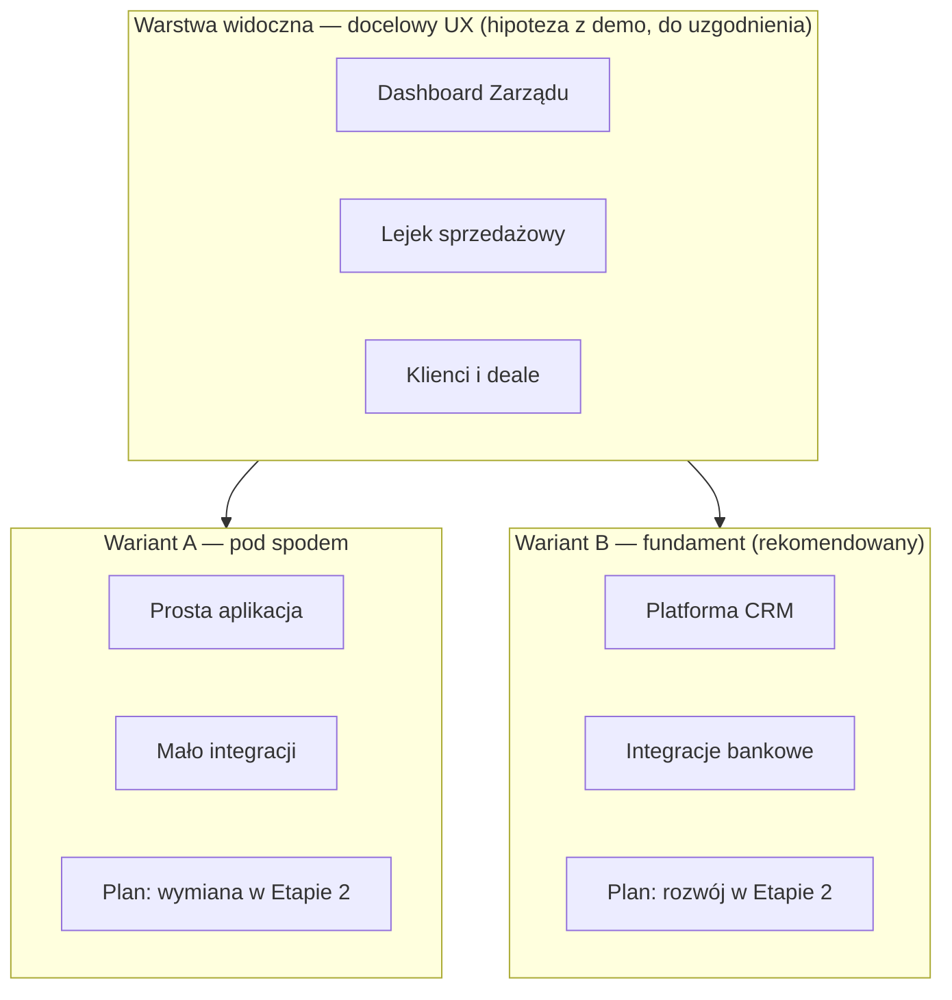
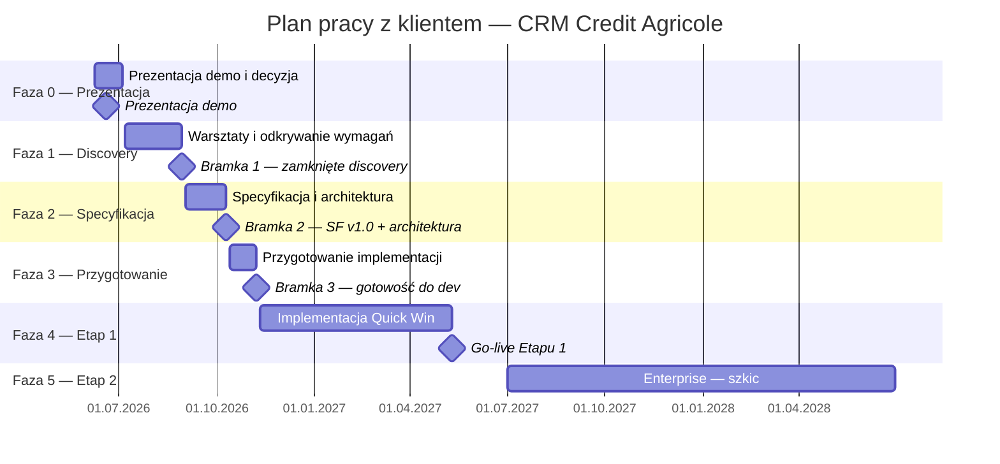

# Plan pracy z klientem — CRM Credit Agricole (przed i w trakcie wdrożenia)

**Klient:** Credit Agricole Bank Polska S.A. — bankowość korporacyjna  
**Status dokumentu:** wersja robocza 1.0  
**Data:** 5 czerwca 2026 r.  
**Zakres:** plan warsztatów, harmonogram i produkty powstające po każdej fazie — **zanim** rozpocznie się implementacja produkcyjna; kontynuacja po zamknięciu fazy odkrywania wymagań.

### Dla kogo jest ten dokument

| Odbiorca                                      | Po co czyta                                                                                                             |
| --------------------------------------------- | ----------------------------------------------------------------------------------------------------------------------- |
| **Członek Zarządu / sponsor**                 | Zrozumieć, co bank dostanie w Etapie 1, jak wygląda ścieżka do Etapu 2 i czym różnią się warianty wdrożenia (sekcja 2). |
| **Menedżer ds. CRM**                          | Zaplanować warsztaty, zebrać wymagania, doprowadzić do specyfikacji przed kodowaniem.                                   |
| **Dyrektor IT ds. bankowości korporacyjnej**  | Ocenić integracje, bezpieczeństwo, wariant technologiczny i bramki decyzyjne.                                           |
| **Zespół wykonawcy (sprzedaż, analiza, dev)** | Wiedzieć, co robić w której fazie i jakie dokumenty dostarczyć.                                                         |
| **Nowy uczestnik projektu**                   | Sekcja 2 (strategia i warianty), następnie sekcja 4 (harmonogram). Nieznane terminy — słownik poniżej.                  |

### Spis treści

1. [Założenia i cele planu](#1-założenia-i-cele-planu)
2. [Strategia wdrożenia — Etapy 1 i 2, warianty A i B](#2-strategia-wdrożenia--etapy-programu-i-warianty-technologiczne)
3. [Harmonogram — widok Gantt](#3-harmonogram--widok-gantt)
4. [Szczegóły harmonogramu](#4-szczegóły-harmonogramu)
5. [Faza 0 — Prezentacja demo](#5-faza-0--prezentacja-demo-i-decyzja-o-współpracy)
6. [Faza 1 — Warsztaty](#6-faza-1--odkrywanie-wymagań-i-warsztaty-z-klientem)
7. [Faza 2 — Specyfikacja](#7-faza-2--specyfikacja-funkcjonalna-i-architektura)
8. [Faza 3 — Przygotowanie implementacji](#8-faza-3--przygotowanie-implementacji-etapu-1)
9. [Faza 4 — Implementacja Etapu 1](#9-faza-4--implementacja-etapu-1-quick-win)
10. [Faza 5 — Etap 2 Enterprise](#10-faza-5--etap-2-enterprise-szkic-planu)
11. [Demo vs produkt wdrożeniowy](#11-różnica-demo-prototypowe-vs-produkt-wdrożeniowy)
12. [Zespół i role](#12-zespół-i-role-propozycja)
13. [Rejestr pytań otwartych](#13-rejestr-otwartych-pytań-do-zamknięcia-w-fazie-1)
14. [Kryteria sukcesu](#14-kryteria-sukcesu-całego-planu)
15. [Następne kroki](#15-następne-kroki-rekomendacja)
16. [Historia dokumentu](#16-historia-dokumentu)

**Źródła wejściowe (stan na dziś):**

| Źródło                                                   | Rola w planie                                                                  |
| -------------------------------------------------------- | ------------------------------------------------------------------------------ |
| [`CABPL-CRM-notka.md`](./CABPL-CRM-notka.md)             | Jedyna zweryfikowana wiedza biznesowa od klienta                               |
| [`requirements.md`](./requirements.md), demo US-01…US-20 | **Hipotezy UX i zakresu** — do walidacji z klientem, nie wymagania kontraktowe |
| [`stories/README.md`](./stories/README.md)               | Mapa tego, co zbudowano w prototypie prezentacyjnym                            |

---

## Słownik — role, organizacja i terminy

W dokumencie używamy **pełnych nazw**. Poniżej zebrano skróty, które mogą pojawić się w nazwach dokumentów lub rozmowach technicznych.

### Role i obszary w banku

| Termin                                          | Znaczenie                                                                                                   |
| ----------------------------------------------- | ----------------------------------------------------------------------------------------------------------- |
| **Bankowość korporacyjna**                      | Pion banku obsługujący klientów firmowych (~1500 aktywnych podmiotów). W notatce spotkania: „BK”.           |
| **Członek Zarządu**                             | Sponsor projektu; główny odbiorca raportów zarządczych.                                                     |
| **Menedżer ds. CRM**                            | Właściciel produktu po stronie banku; codzienne decyzje o zakresie i priorytetach.                          |
| **Dyrektor IT ds. bankowości korporacyjnej**    | Odpowiedzialny za architekturę, integracje i środowiska w pionie korporacyjnym.                             |
| **Analityk biznesowy (bankowość korporacyjna)** | Opisuje procesy sprzedażowe i współtworzy specyfikację funkcjonalną.                                        |
| **Regionalny menedżer sprzedaży**               | Nadzoruje zespół doradców w regionie; widzi lejek i klientów całego zespołu. W skrótach wewnętrznych: „RM”. |
| **Doradca korporacyjny**                        | Opiekun klientów; pracuje na własnym lejku, zadaniach i kalendarzu.                                         |
| **Credit Agricole Bank Polska**                 | Klient projektu. Skrót wewnętrzny: CABPL.                                                                   |

### Dokumenty i metodyki

| Termin                                            | Znaczenie                                                           |
| ------------------------------------------------- | ------------------------------------------------------------------- |
| **Specyfikacja funkcjonalna**                     | Główny dokument wymagań: przypadki użycia, ekrany, słowniki.        |
| **Wstępna architektura systemu**                  | Opis komponentów, integracji i środowisk (w IT: HLD).               |
| **Priorytetyzacja Must / Should / Could / Won't** | Metoda klasyfikacji wymagań (MoSCoW).                               |
| **Bramka decyzyjna**                              | Punkt kontrolny — bez akceptacji nie przechodzimy do kolejnej fazy. |
| **Testy akceptacyjne użytkowników**               | Weryfikacja systemu z użytkownikami końcowymi przed odbiorem (UAT). |
| **List intencyjny**                               | Wstępne zobowiązanie do współpracy przed pełną umową (LOI).         |

### Technologia i compliance

| Termin                                                              | Znaczenie                                                                |
| ------------------------------------------------------------------- | ------------------------------------------------------------------------ |
| **Komisja Nadzoru Finansowego (KNF)**                               | Regulator; wymogi bezpieczeństwa i zgodności dla banków w Polsce.        |
| **Zarządzanie tożsamością i dostępem (IAM)**                        | Konta, role, logowanie — w banku zwykle z jednokrotnym logowaniem (SSO). |
| **Dostęp oparty na rolach (RBAC)**                                  | Użytkownik widzi tylko dane przewidziane dla swojej roli.                |
| **Środowisko deweloperskie / testowe / akceptacyjne / produkcyjne** | Kolejne etapy uruchomienia systemu (DEV → TEST → UAT → PROD).            |
| **Minimalna wersja produktu (MVP)**                                 | Najmniejszy zakres dający realną wartość biznesową.                      |
| **Normalna eksploatacja (BAU)**                                     | Codzienne użytkowanie systemu po zakończeniu projektu wdrożeniowego.     |

### Strategia programu CRM (skrót — szczegóły w sekcji 2)

| Termin                                           | Znaczenie                                                                                                                                                                              |
| ------------------------------------------------ | -------------------------------------------------------------------------------------------------------------------------------------------------------------------------------------- |
| **Etap 1 „Quick Win”**                           | Pierwsza dostawa CRM: raportowanie dla Zarządu, lejek sprzedażowy, klienci, leady, zadania — w horyzoncie 3–6 miesięcy od startu implementacji.                                        |
| **Etap 2 „Enterprise”**                          | Docelowy CRM: widok klienta 360°, zarządzanie sprawami, głębokie integracje z systemami banku — po ustabilizowaniu Etapu 1.                                                            |
| **Wariant A — nakładka tymczasowa**              | Szybkie, tanie rozwiązanie na pilne potrzeby; **planuje się jego likwidację** przy budowie Etapu 2 od nowa. **Nie jest rekomendowany** przez wykonawcę.                                |
| **Wariant B — fundament docelowego CRM**         | **Rekomendowany.** Etap 1 jako pierwsze wydanie docelowej platformy; system **zostaje i jest rozbudowywany** w Etapie 2.                                                               |
| **Programowanie agentowe (agentic programming)** | Metoda wytwarzania przy wdrożeniu wariantu B — skraca czas implementacji **bez** zmiany architektury fundamentu. Demo **ilustruje** tempo tej metody; **nie jest** kodem produkcyjnym. |

---

## 1. Założenia i cele planu

### 1.1 Problem

Z [`notatki ze spotkania sprzedażowego`](./CABPL-CRM-notka.md) (25.05.2026 — spotkanie już się odbyło) wynika, że bank potrzebuje systemu CRM w **bankowości korporacyjnej**. Priorytetem jest szybki **Etap 1 „Quick Win”** (3 miesiące oficjalnie, 5–6 realistycznie), a docelowo **Etap 2 Enterprise** (widok klienta 360°, zarządzanie sprawami). Demo na laptopie pokazuje, że **interfejs i zakres można zbudować szybko** (programowanie agentowe) — ale **nie jest** podstawą implementacji produkcyjnej i **nie zastępuje** analizy procesów, danych, integracji i zgodności regulacyjnej.

### 1.2 Cel planu

1. Uporządkować **pracę z klientem przed kodowaniem produkcyjnym**.
2. Zdefiniować **warsztaty**, uczestników, pytania i oczekiwane decyzje.
3. Określić **harmonogram** i **produkty** powstające po każdej fazie.
4. Połączyć fazy odkrywania wymagań z dwuetapową strategią klienta (Quick Win → Enterprise).

### 1.3 Zasady pracy

| #   | Zasada                                                                                                                                                                                                                   |
| --- | ------------------------------------------------------------------------------------------------------------------------------------------------------------------------------------------------------------------------ |
| 1   | **Demo ≠ specyfikacja ≠ kod produkcyjny** — prototyp służy prezentacji i walidacji hipotez UX; produkcja (wariant B) powstaje **od nowa** po specyfikacji, na **fundamencie** architektury bankowej.                     |
| 2   | **Jeden wątek decyzyjny** — sponsor (Członek Zarządu) + Menedżer ds. CRM + Dyrektor IT ds. bankowości korporacyjnej na kluczowych bramkach decyzyjnych.                                                                  |
| 3   | **Zgodność regulacyjna od początku** — wymogi KNF, tajemnica bankowa, logowanie bankowe, hosting — osobna ścieżka warsztatowa, nie „dopisek na końcu”.                                                                   |
| 4   | **Rekomendacja wykonawcy: wariant B (fundament)** — [sekcja 2](#2-strategia-wdrożenia--etapy-programu-i-warianty-technologiczne). Ostateczny wybór A vs B zapada **po** warsztatach (Bramka 2), nie na prezentacji demo. |
| 5   | **Specyfikacja funkcjonalna** — pełna struktura delivery: wymagania kontraktowe, przypadki użycia, ekrany, słowniki danych i pojęć; dostosowana do bankowości korporacyjnej i wymogów KNF.                               |

---

## 2. Strategia wdrożenia — Etapy programu i warianty technologiczne

Ta sekcja wyjaśnia **cały program CRM** w ujęciu biznesowym. Bez niej reszta dokumentu (warsztaty, harmonogram) może wyglądać jak lista zadań bez kontekstu „co właściwie kupujemy”.

### 2.1 Kontekst — dlaczego dwa etapy

Credit Agricole potrzebuje CRM w bankowości korporacyjnej **teraz** — obecne narzędzia (m.in. Microsoft Access) nie wystarczają, a Zarząd oczekuje raportów i cyfryzacji sprzedaży. Jednocześnie pełny system klasy Enterprise (widok klienta 360°, obsługa spraw, integracje z całym bankiem) **nie zmieści się w 3 miesiące**.

Dlatego program jest **dwuetapowy**:

| Etap       | Nazwa      | Co bank dostaje                                                                                                        | Horyzont (orientacyjny)                                            |
| ---------- | ---------- | ---------------------------------------------------------------------------------------------------------------------- | ------------------------------------------------------------------ |
| **Etap 1** | Quick Win  | Raportowanie dla Zarządu, lejek sprzedażowy, klienci, leady, zadania, kalendarz — zakres do uzgodnienia na warsztatach | 3 miesiące (deklaracja klienta) / **5–6 miesięcy** (realistycznie) |
| **Etap 2** | Enterprise | Widok klienta 360° (produkty, limity, grupa kapitałowa), zarządzanie sprawami (reklamacje, back-office)                | Po ustabilizowaniu Etapu 1; osobna faza, 9–12+ miesięcy            |

**Ważne:** Etap 1 i Etap 2 to **nie dwa różne produkty na ekranie** w sensie „użytkownik widzi co innego”. To **dwa etapy jednego programu** — najpierw pilne funkcje, potem rozwinięcie platformy.

---

### 2.2 Co pokazuje demo na laptopie — i czego demo **nie** jest

Interaktywne demo (aplikacja na `npm run dev`) to **materiał prezentacyjny**: propozycja wyglądu i hipotez zakresu Etapu 1. Powstało szybko metodą **programowania agentowego**, aby pokazać klientowi, że **taki poziom UI i funkcjonalności da się dostarczyć w krótkim czasie** — przy wdrożeniu produkcyjnym z tą samą metodą wytwarzania, ale na **innej architekturze**.

| Czego demo **jest**                                    | Czego demo **nie jest**                                    |
| ------------------------------------------------------ | ---------------------------------------------------------- |
| Wizualizacją możliwego CRM Etapu 1                     | Umową ani specyfikacją                                     |
| Dowodem szybkości wytwarzania (programowanie agentowe) | Kodem bazowym pod produkcję                                |
| Zbiorem hipotez UX do warsztatów                       | Systemem z logowaniem bankowym, bazą danych i integracjami |
| Wspólnym punktem rozmowy o wariantach A/B              | Zamiennikiem fazy odkrywania wymagań                       |

| Aspekt             | Demo (dziś)                               | Produkt po wdrożeniu Etapu 1                               |
| ------------------ | ----------------------------------------- | ---------------------------------------------------------- |
| Kod źródłowy       | Prototyp lokalny, poza architekturą banku | Nowa implementacja wg specyfikacji i wstępnej architektury |
| Logowanie          | Wybór użytkownika z listy (symulacja)     | Logowanie kontem bankowym (jednokrotne logowanie)          |
| Dane               | Pliki JSON, zmiany tylko do restartu      | Baza danych, migracje, importy z systemów banku            |
| Hosting            | Laptop prezentera                         | Środowisko banku / chmura zgodna z KNF                     |
| Integracje         | Brak                                      | Według ustaleń z warsztatów                                |
| Funkcje na ekranie | Hipotezy do potwierdzenia z klientem      | Tylko to, co wpisze specyfikacja funkcjonalna              |

**Przy prezentacji** pokazujemy ten sam prototyp przy omawianiu wariantu A i **rekomendowanego wariantu B**. Różnica dotyczy **architektury produkcyjnej i losu systemu w Etapie 2** — nie przeniesienia kodu demo do banku.

---

### 2.3 Wariant A — nakładka tymczasowa („szybko i tanio, potem wymiana”)

#### Definicja

**Wariant A** to świadomie **tymczasowe** rozwiązanie: dedykowana aplikacja pod najpilniejsze potrzeby (dashboard Zarządu, lejek, podstawowa praca doradcy), zbudowana **jak najszybciej i najtaniej**, z założeniem, że przy Etapie 2 **zostanie zastąpiona** nowym systemem Enterprise — a nie rozbudowana.

Na tym spotkaniu klient **wyraził gotowość** do scenariusza, w którym Etap 1 może zostać później zastąpiony — pod warunkiem szybkiego efektu biznesowego (wariant A; nie jest rekomendowany).

#### Co to znaczy w praktyce (dla biznesu)

- Doradcy i menedżerowie **dostają działający CRM** w kilka miesięcy.
- Zarząd **dostaje raporty i prognozy** bez czekania na wieloletni projekt.
- Za 12–24 miesiące bank **planuje nowy, duży CRM** (Etap 2) i **przenosi dane** ze starego narzędzia.
- Użytkownicy **uczą się systemu, który docelowo zniknie** — to koszt organizacyjny wariantu A.

#### Co to znaczy w praktyce (dla IT)

- Prostsza architektura: mniej integracji na start, część danych ręcznie lub import z plików.
- Krótsza ścieżka audytu bezpieczeństwa niż przy pełnej platformie — ale **nadal** wymogi KNF muszą być spełnione.
- Ograniczenia rozbudowy: np. trudniej dodać Client 360° bez przebudowy fundamentu.
- Przy Etapie 2: **nowy projekt**, migracja danych, często **podwójny koszt** (raz Etap 1, raz Etap 2 od zera).

#### Kiedy wariant A ma sens

- Sponsor mówi wprost: _„Potrzebuję efektu w kwartale; za rok zdecydujemy o dużym CRM.”_
- Budżet na start jest **mocno ograniczony**.
- IT nie jest gotowe na pełne integracje i środowisko produkcyjne w 3 miesiące.
- Bank akceptuje **ryzyko zmiany narzędzia** dla użytkowników za 1–2 lata.

#### Jedno zdanie dla zarządu

> „Dajemy Wam szybki CRM na najbliższe 12–18 miesięcy; potem budujemy właściwy system Enterprise i migrujemy dane.”

---

### 2.4 Wariant B — fundament docelowego CRM (**rekomendowany**)

#### Definicja

**Wariant B** to **rekomendowana ścieżka wdrożenia**. Etap 1 traktujemy jako **pierwsze wydanie docelowej platformy CRM** (fundament), a nie jednorazówkę. Ten sam system **rosnie** w Etapie 2 — dokładamy widok klienta 360° i zarządzanie sprawami do tego, co już działa.

Zgodnie z kierunkiem z [`CABPL-CRM-notka.md`](./CABPL-CRM-notka.md): szybki efekt biznesowy **bez** planowanej likwidacji rozwiązania po Etapie 1 (rekomendacja wykonawcy: wariant B).

#### Co to znaczy w praktyce (dla biznesu)

- Użytkownicy **uczą się jednego systemu**, który zostaje na lata.
- Etap 2 to **rozwinięcie**, nie „nowy CRM od zera”.
- **Niższy łączny koszt programu** w perspektywie 3–5 lat (jedna platforma, ciągłość danych).
- Czas pierwszej dostawy można skrócić **programowaniem agentowym** — bez rezygnacji z fundamentu.

#### Co to znaczy w praktyce (dla IT)

- Od początku: baza danych, logowanie bankowe, model danych pod przyszłe moduły, audyt operacji.
- Integracje w Etapie 1 według ustaleń z warsztatów (Must).
- Przygotowanie środowisk i zgód security **przed** pierwszym uruchomieniem produkcyjnym.
- Etap 2 = **nowe moduły i integracje** na istniejącym fundamencie.
- Implementacja **od zera** po specyfikacji — **nie** na kodzie demo.

#### Programowanie agentowe w wariancie B

|                  | Demo (prezentacja)                     | Wariant B — produkcja                |
| ---------------- | -------------------------------------- | ------------------------------------ |
| **Cel**          | Pokazać możliwy UX i tempo wytwarzania | Dostarczyć system w środowisku banku |
| **Architektura** | Prototyp lokalny                       | Fundament pod rozwój (Etap 2)        |
| **Kod**          | Jednorazowy prototyp                   | Nowa implementacja wg specyfikacji   |
| **Metoda**       | Programowanie agentowe                 | Ta sama metoda + pełny stack bankowy |

#### Jedno zdanie dla zarządu

> „Budujemy od razu właściwy CRM bankowy na fundamencie pod rozwój — w pierwszej wersji to, co dziś najbardziej boli; reszta dojdzie w Etapie 2 na tym samym systemie.”

#### Narracja na prezentacji demo

> „Rekomendujemy wariant B: fundament docelowego CRM. Demo powstało szybko dzięki programowaniu agentowemu — taką samą metodą zbudujemy produkcję **od zera**, na architekturze bankowej, bez planowanej wymiany systemu za rok.”

---

### 2.5 Porównanie wariantów — tabela zbiorcza

| Kryterium                               | Wariant A — nakładka                          | Wariant B — fundament (**rekomendowany**) |
| --------------------------------------- | --------------------------------------------- | ----------------------------------------- |
| **Status u wykonawcy**                  | Akceptowalny u klienta; **nie rekomendowany** | **Rekomendowany**                         |
| **Cel Etapu 1**                         | Natychmiastowy efekt, narzędzie przejściowe   | Fundament docelowej platformy             |
| **Los systemu z Etapu 1 przy Etapie 2** | Wycofanie i budowa od nowa                    | Rozbudowa                                 |
| **Czas do pierwszego go-live**          | Najkrótszy                                    | 5–6 mies. (realistycznie)                 |
| **Koszt Etapu 1**                       | Najniższy                                     | Wyższy niż A                              |
| **Koszt całego programu (3–5 lat)**     | Często wyższy (dwa wdrożenia)                 | Często niższy (jedna platforma)           |
| **Integracje w Etapie 1**               | Minimum                                       | Według Must z warsztatów                  |
| **Kod demo jako baza produkcji**        | Nie                                           | Nie                                       |
| **Metoda wytwarzania**                  | Nakładka, minimalna architektura              | Fundament + programowanie agentowe        |

---

### 2.6 Co użytkownik widzi vs co się zmienia „pod spodem”

**Dla doradcy korporacyjnego** ekran lejka i karty klienta może wyglądać **identycznie** w A i B.  
**Dla dyrektora IT** różnica jest fundamentalna: w A budujecie narzędzie na okres przejściowy; w B — kolejny system bankowy na lata.

---

### 2.7 Wpływ wariantu na Etap 2

| Scenariusz                 | Wariant A                          | Wariant B (rekomendowany)           |
| -------------------------- | ---------------------------------- | ----------------------------------- |
| **Client 360°**            | Nowy system + migracja z Etapu 1   | Moduł dokładany do istniejącego CRM |
| **Zarządzanie sprawami**   | Nowy system                        | Moduł dokładany                     |
| **Dane historyczne**       | Migracja jednorazowa, ryzyko strat | Ciągłość w jednej bazie             |
| **Szkolenia użytkowników** | Drugi raz przy Etapie 2            | Jedna ścieżka onboardingu           |
| **Umowa z wykonawcą**      | Często osobny projekt Etap 2       | Kontynuacja / rozszerzenie umowy    |

---

### 2.8 Kiedy zapadnie decyzja o wariancie

| Moment                                     | Co się dzieje                                                            | Czy decyzja A/B?                    |
| ------------------------------------------ | ------------------------------------------------------------------------ | ----------------------------------- |
| **Prezentacja demo (08–19.06.2026)**       | Pokaz UI + **wyjaśnienie** wariantów (ta sekcja w skrócie)               | **Nie** — tylko wstępna preferencja |
| **Aktywność 0.3 (po demo)**                | Rozmowa IT + Menedżer CRM o kierunku                                     | Sygnał, nie kontrakt                |
| **Warsztat 1**                             | Czy bank akceptuje likwidację narzędzia po Etapie 1?                     | Wstępna odpowiedź biznesowa         |
| **Warsztat 7**                             | Integracje, hosting, IAM, koszt utrzymania                               | Dane pod decyzję                    |
| **Produkt P1.8**                           | Rekomendacja pisemna: **wariant B** vs alternatywa A (+ koszt całkowity) | Rekomendacja wykonawcy (B)          |
| **Bramka 2 (specyfikacja + architektura)** | Podpis zakresu i modelu technicznego                                     | **Tak — decyzja wiążąca**           |

**Zasada:** nikt nie powinien podpisywać implementacji na konkretny wariant **wyłącznie na podstawie demo**. Decyzja wymaga warsztatów, szacunku kosztów i zgody IT na integracje i bezpieczeństwo.

---

### 2.9 Wpływ wariantu na harmonogram (orientacyjnie)

| Faza                        | Wariant A              | Wariant B (rekomendowany)       |
| --------------------------- | ---------------------- | ------------------------------- |
| Odkrywanie wymagań          | 6–8 tyg. (standard)    | 6–8 tyg.                        |
| Specyfikacja + architektura | 4–6 tyg.               | 5–7 tyg.                        |
| Implementacja Etap 1        | 3–4 mies. (agresywnie) | 5–6 mies.                       |
| Przygotowanie Etapu 2       | Nowy projekt od zera   | Rozszerzenie — krótszy kick-off |

Termin **3 miesięcy** z notatki klienta jest realny głównie przy **wariancie A**. Przy **rekomendowanym wariancie B** bezpieczniej planować **5–6 miesięcy** na Etap 1.

---

## 3. Harmonogram — widok Gantt

**Harmonogram roboczy** — daty orientacyjne, do korekty po decyzji klienta o współpracy. Warunki startu i bramki decyzyjne w [§4](#4-szczegóły-harmonogramu).

Fazy są **sekwencyjne** — start kolejnej fazy zależy od zamknięcia bramki decyzyjnej poprzedniej (patrz §4.2).

---

## 4. Szczegóły harmonogramu

**Punkt odniesienia:** prezentacja demo w oknie **8–19.06.2026** ([`CABPL-CRM-notka.md`](./CABPL-CRM-notka.md), sekcja 4). Terminy na wykresie Gantt ([§3](#3-harmonogram--widok-gantt)) i w tabeli poniżej są **spójne**.

### 4.1 Fazy i warunki startu

| Faza                                 | Okres (propozycja)      | Czas trwania | Warunek startu                                                                                                                                              |
| ------------------------------------ | ----------------------- | ------------ | ----------------------------------------------------------------------------------------------------------------------------------------------------------- |
| **0** Prezentacja i decyzja          | 08.06 – 04.07.2026      | ~4 tyg.      | Demo gotowe                                                                                                                                                 |
| **1** Odkrywanie wymagań / warsztaty | 07.07 – 29.08.2026      | ~8 tyg.      | Zainteresowanie klienta + umowa ramowa lub list intencyjny                                                                                                  |
| **2** Specyfikacja i architektura    | 01.09 – 10.10.2026      | ~6 tyg.      | Zamknięte warsztaty 1–7, backlog priorytetyzowany                                                                                                           |
| **3** Przygotowanie implementacji    | 13.10 – 07.11.2026      | ~4 tyg.      | Zatwierdzona specyfikacja funkcjonalna v1.0 + architektura + **wybrany wariant** ([§2.9](#2-strategia-wdrożenia--etapy-programu-i-warianty-technologiczne)) |
| **4** Implementacja Etap 1           | 10.11.2026 – 10.05.2027 | **~6 mies.** | Kick-off techniczny, środowiska, logowanie bankowe                                                                                                          |
| **5** Etap 2 (szkic)                 | od III kw. 2027         | 9–12+ mies.  | Stabilny Etap 1, priorytety biznesowe                                                                                                                       |

> **Uwaga:** Termin **3 miesięcy** z notatki klienta jest osiągalny tylko przy **agresywnym** zakresie minimalnej wersji produktu + gotowych decyzjach po Fazie 1–2 w ~6 tygodni oraz równoległej pracy nad bezpieczeństwem i logowaniem bankowym. Realistyczny harmonogram implementacji to **5–6 miesięcy** — zgodnie z notatką „nieoficjalnym terminem”. Faza odkrywania wymagań **nie powinna być skracana** poniżej 6 tygodni w banku korporacyjnym.

### 4.2 Bramki decyzyjne i kamienie milowe

| Data (orientacyjna) | Kamień milowy                                   | Co musi być spełnione                                       |
| ------------------- | ----------------------------------------------- | ----------------------------------------------------------- |
| 19.06.2026          | Prezentacja demo                                | Kontynuacja / stop                                          |
| 04.07.2026          | Notatka feedback + wstępna preferencja wariantu | Zlecenie fazy odkrywania wymagań                            |
| 29.08.2026          | **Bramka 1** — zamknięte odkrywanie wymagań     | Backlog priorytetyzowany zatwierdzony                       |
| 10.10.2026          | **Bramka 2** — specyfikacja v1.0 + architektura | Zakres Etapu 1 zamrożony; wariant A lub B (rekomendacja: B) |
| 07.11.2026          | **Bramka 3** — gotowość do developmentu         | Środowiska, logowanie bankowe, plan testów akceptacyjnych   |
| 01.2027             | Wydanie 1 — pilotaż operacyjny                  | Testy akceptacyjne pilotażowe                               |
| 03.2027             | Wydanie 2 — raportowanie zarządcze              | Akceptacja Zarządu                                          |
| 10.05.2027          | **Go-live Etapu 1**                             | Przekazanie do normalnej eksploatacji                       |
| III kw. 2027        | Kick-off Etapu 2                                | Osobna umowa / zmiana zakresu                               |

---

## 5. Faza 0 — Prezentacja demo i decyzja o współpracy

**Cel:** potwierdzić zrozumienie potrzeby, zebrać pierwsze sygnały, otworzyć ścieżkę do warsztatów — **bez** obiecywania zakresu implementacji.

### 5.1 Aktywności

| #   | Aktywność                                                                                                                                                          | Uczestnicy (bank)                                                                                                        | Uczestnicy (wykonawca)                                              | Czas      |
| --- | ------------------------------------------------------------------------------------------------------------------------------------------------------------------ | ------------------------------------------------------------------------------------------------------------------------ | ------------------------------------------------------------------- | --------- |
| 0.1 | Prezentacja demo (ścieżka 15–20 min + pytania i odpowiedzi)                                                                                                        | Członek Zarządu, Menedżer ds. CRM, analityk biznesowy (bankowość korporacyjna), dyrektor IT ds. bankowości korporacyjnej | Lider biznesowy, **kierownik projektu**, analityk / prowadzący demo | 60–90 min |
| 0.2 | Sesja „co nas zaskoczyło / czego brakuje”                                                                                                                          | Jak w 0.1                                                                                                                | **Kierownik projektu** — moderacja i notatka                        | 30 min    |
| 0.3 | Wyjaśnienie wariantów A i B; **rekomendacja: wariant B** ([sekcja 2](#2-strategia-wdrożenia--etapy-programu-i-warianty-technologiczne)) — **bez wiążącej decyzji** | Dyrektor IT + Menedżer ds. CRM (+ opcjonalnie sponsor)                                                                   | Kierownik projektu, lider biznesowy, architekt rozwiązania          | 45 min    |
| 0.4 | Wewnętrzne podsumowanie po stronie wykonawcy                                                                                                                       | —                                                                                                                        | Zespół realizacji (prowadzenie: kierownik projektu)                 | 1 dzień   |

### 5.2 Produkty

| Produkt                                       | Opis                                                                                                                                        | Odbiorca                      |
| --------------------------------------------- | ------------------------------------------------------------------------------------------------------------------------------------------- | ----------------------------- |
| **P0.1** Notatka ze spotkania prezentacyjnego | Feedback, pytania otwarte, sygnały priorytetów                                                                                              | Bank + wykonawca              |
| **P0.2** One-pager Etap 1 vs Etap 2           | Zakres wizualny (już przygotowany narracyjnie w demo)                                                                                       | Sponsor                       |
| **P0.3** One-pager wariantów A i B            | 1 strona: nakładka vs fundament; **rekomendacja: wariant B** ([§2.4–2.5](#2-strategia-wdrożenia--etapy-programu-i-warianty-technologiczne)) | Sponsor, Dyrektor IT          |
| **P0.4** Propozycja fazy odkrywania wymagań   | Ten dokument (skrót) + harmonogram warsztatów                                                                                               | Dyrektor IT, Menedżer ds. CRM |
| **P0.5** Lista hipotez do walidacji           | Tabela: funkcja demo → pytanie do klienta → status                                                                                          | Zespół analityczny            |

### 5.3 Hipotezy z demo do zebrania feedbacku (skrót)

| Obszar demo               | Hipoteza                                   | Pytanie na spotkaniu                                                              |
| ------------------------- | ------------------------------------------ | --------------------------------------------------------------------------------- |
| Analityka / dashboard     | Zarząd chce konfigurowalne panele          | Jakie wskaźniki i źródła danych są obowiązkowe w pierwszym miesiącu?              |
| Deale / lejek sprzedażowy | Lista + karta deala zamiast tablicy kanban | Czy bank pracuje na etapach deala czy na statusach produktowych?                  |
| Firmy / kontakty          | Firma = klient korporacyjny                | Jak mapuje się na systemy bankowe (identyfikator klienta, NIP, grupa kapitałowa)? |
| Leady                     | Osobny moduł leadów                        | Skąd leady wpływają dziś? Import, kampanie, polecenia?                            |
| Produkty                  | Katalog produktów bankowych w CRM          | Czy produkty są synchronizowane z systemem centralnym czy ze słownikiem banku?    |
| Pracownicy / struktura    | Hierarchia opiekunów                       | Jaka jest rzeczywista struktura: region → zespół → doradca?                       |
| Zgodność                  | Wymogi KNF jako plan                       | Jakie polityki banku muszą być spełnione przed pilotażem?                         |

---

## 6. Faza 1 — Odkrywanie wymagań i warsztaty z klientem

**Cel:** zebrać wiedzę wystarczającą do napisania specyfikacji funkcjonalnej i oszacowania Etapu 1 — **bez pisania kodu produkcyjnego**.

**Czas:** 6–8 tygodni, **7 warsztatów** + praca między sesjami (ankiety, przegląd dokumentów, wywiady 1:1).

### 6.1 Warsztaty — program

#### Warsztat 1 — Wizja, cele i sukces projektu

| Element                    | Szczegóły                                                                                                                                                                                          |
| -------------------------- | -------------------------------------------------------------------------------------------------------------------------------------------------------------------------------------------------- |
| **Czas**                   | 3 h                                                                                                                                                                                                |
| **Uczestnicy (bank)**      | Członek Zarządu (sponsor), Menedżer ds. CRM, dyrektor IT ds. bankowości korporacyjnej                                                                                                              |
| **Uczestnicy (wykonawca)** | Lider biznesowy, architekt rozwiązania                                                                                                                                                             |
| **Cele**                   | Zdefiniować „sukces za 3 mies.” vs „sukces za 6 mies.”; ustalić metryki (np. adopcja, raport dla zarządu, liczba użytkowników pilotażu)                                                            |
| **Decyzje wyjściowe**      | Cele SMART Etapu 1; definicja pilotażu (ile regionów / użytkowników); **czy bank akceptuje likwidację systemu z Etapu 1** (wariant A) czy wybiera fundament pod rozwój (wariant B — rekomendowany) |

**Agenda (skrót):**

1. Dlaczego CRM teraz — drivery z notatki (Access, cyfryzacja, ~1500 klientów).
2. Oczekiwania Zarządu vs operacji — priorytet raportowanie vs lejek.
3. Granice Etapu 1 — co **świadomie** odkładamy do Etapu 2.
4. Kryteria akceptacji uruchomienia produkcyjnego (biznesowe, nie techniczne).

---

#### Warsztat 2 — Procesy sprzedażowe i lejek (stan obecny → stan docelowy)

| Element               | Szczegóły                                                                                                                          |
| --------------------- | ---------------------------------------------------------------------------------------------------------------------------------- |
| **Czas**              | 4 h                                                                                                                                |
| **Uczestnicy (bank)** | Menedżer ds. CRM, analityk biznesowy, 2–3 regionalnych menedżerów sprzedaży, 2–3 doradców korporacyjnych                           |
| **Cele**              | Zmapować proces od leada do zamknięcia; ustalić etapy lejka, reguły przejść, prawdopodobieństwa, powiązanie z produktami bankowymi |
| **Decyzje wyjściowe** | Słownik etapów deala; reguły wygrana/przegrana; czy lejek per produkt / per klient / per relacja                                   |

**Pytania otwarte z notatki:**

- Nazwy i liczba etapów lejka w bankowości korporacyjnej.
- Czy „deal” = jedna szansa sprzedażowa wieloproduktowa?
- Jak dziś wygląda współpraca z back-office przy ofertowaniu?

**Materiały wejściowe:** zrzuty ekranów Access / Excel; przykładowy raport miesięczny regionalnego menedżera.

---

#### Warsztat 3 — Raportowanie zarządcze i wskaźniki KPI

| Element               | Szczegóły                                                                                                                         |
| --------------------- | --------------------------------------------------------------------------------------------------------------------------------- |
| **Czas**              | 3 h                                                                                                                               |
| **Uczestnicy (bank)** | Członek Zarządu (lub delegat), Menedżer ds. CRM, controlling / planowanie finansowe (jeśli dostępny), analityk                    |
| **Cele**              | Zdefiniować obowiązkowe wskaźniki, wymiary (region, segment, produkt), częstotliwość, źródła planu sprzedażowego                  |
| **Decyzje wyjściowe** | Lista wskaźników w minimalnej wersji produktu; model planu (import vs integracja); wymagania prognozy (scenariusze, ważony lejek) |

**Walidacja hipotez z demo:** zakładki Analityka, widżety, filtry globalne, ograniczenia dostępu do wrażliwych metryk.

---

#### Warsztat 4 — Klienci, kontakty, historia interakcji

| Element               | Szczegóły                                                                                                     |
| --------------------- | ------------------------------------------------------------------------------------------------------------- |
| **Czas**              | 4 h                                                                                                           |
| **Uczestnicy (bank)** | Analityk biznesowy, doradcy, reprezentant ds. danych klienta / zarządzania danymi referencyjnymi (jeśli jest) |
| **Cele**              | Model klienta korporacyjnego w CRM; zakres karty klienta Etap 1; historia kontaktów — ręczna vs integracje    |
| **Decyzje wyjściowe** | Pola obowiązkowe firmy i kontaktu; typy zdarzeń na osi czasu; realność „wszystkich kanałów” w 3–6 mies.       |

**Pytania otwarte z notatki:**

- Kalendarz i moduł klientów — szczegółowy zakres Etapu 1.
- Historia kontaktów ze wszystkimi kanałami — import, integracja, czy model hybrydowy?

---

#### Warsztat 5 — Leady, zadania, kalendarz, sugerowana następna akcja

| Element               | Szczegóły                                                                                                                               |
| --------------------- | --------------------------------------------------------------------------------------------------------------------------------------- |
| **Czas**              | 3 h                                                                                                                                     |
| **Uczestnicy (bank)** | Menedżer ds. CRM, doradcy, opcjonalnie marketing / pozyskiwanie klientów                                                                |
| **Cele**              | Źródła leadów; reguły przypisania; model zadań i spotkań; definicja sugerowanej następnej akcji (reguły statyczne vs uczenie maszynowe) |
| **Decyzje wyjściowe** | Czy leady w minimalnej wersji produktu; minimalny kalendarz; pierwsze 5–10 reguł sugestii                                               |

---

#### Warsztat 6 — Role, organizacja, dostęp i adopcja

| Element               | Szczegóły                                                                                                                      |
| --------------------- | ------------------------------------------------------------------------------------------------------------------------------ |
| **Czas**              | 3 h                                                                                                                            |
| **Uczestnicy (bank)** | Menedżer ds. CRM, HR / struktura organizacyjna, dyrektor IT, przedstawiciel zarządzania tożsamością                            |
| **Cele**              | Macierz ról (doradca, regionalny menedżer, zarząd, administrator, back-office); widoczność danych; model delegacji i zastępstw |
| **Decyzje wyjściowe** | Słownik ról; zasady widoczności; wymagania jednokrotnego logowania i zakładania kont                                           |

**Walidacja:** struktura z demo (doradca, regionalny menedżer, członek zarządu) — potwierdzenie lub korekta.

---

#### Warsztat 7 — IT, integracje, hosting, zgodność z KNF

| Element               | Szczegóły                                                                                                                                      |
| --------------------- | ---------------------------------------------------------------------------------------------------------------------------------------------- |
| **Czas**              | 4 h (+ możliwa sesja uzupełniająca 2 h)                                                                                                        |
| **Uczestnicy (bank)** | Dyrektor IT ds. bankowości korporacyjnej, architekt banku, security / compliance, opcjonalnie zakupy                                           |
| **Cele**              | Mapa systemów (core banku, legacy CRM, hurtownia danych, kalendarz, e-mail); wymagania środowisk; polityka chmury KNF; zarządzanie tożsamością |
| **Decyzje wyjściowe** | Lista integracji obowiązkowe / pożądane / opcjonalne na Etap 1; model hostingu; ścieżka audytu bezpieczeństwa                                  |

**Tematy obowiązkowe:** KYC, tajemnica bankowa, logowanie operacji, retencja, backup, segregacja środowisk.

---

### 6.2 Praca między warsztatami

| Aktywność                                                   | Kto                               | Produkt pośredni                    |
| ----------------------------------------------------------- | --------------------------------- | ----------------------------------- |
| Wywiady 1:1 z doradcami (3–5 osób)                          | Analityk                          | Notatki jakościowe                  |
| Przegląd artefaktów stanu obecnego (Access, Excel, raporty) | Analityk + bank                   | Inwentarz artefaktów                |
| Ankieta krótka (cyfrowa) — ból operacyjny TOP 5             | Doradcy i regionalni menedżerowie | Ranking problemów                   |
| Checklist struktury specyfikacji funkcjonalnej              | Architekt                         | Luki w dokumentacji do uzupełnienia |

### 6.3 Produkty Fazy 1

| ID       | Produkt                                                  | Zawartość (min.)                                                                                                                                                                                                                             | Odbiorca                           | Kryterium ukończenia                 |
| -------- | -------------------------------------------------------- | -------------------------------------------------------------------------------------------------------------------------------------------------------------------------------------------------------------------------------------------- | ---------------------------------- | ------------------------------------ |
| **P1.1** | **Raport stanu obecnego (AS-IS)**                        | Narzędzia, procesy, bóle, metryki „dziś”                                                                                                                                                                                                     | Menedżer ds. CRM                   | Review bez uwag krytycznych          |
| **P1.2** | **Mapa procesów stanu docelowego (TO-BE)**               | Diagramy procesów: lead → deal → wygrana; raportowanie                                                                                                                                                                                       | Analityk + regionalni menedżerowie | Zatwierdzone na warsztatach 2 i 3    |
| **P1.3** | **Macierz ról i uprawnień**                              | Rola × moduł × zakres danych                                                                                                                                                                                                                 | IT + Menedżer ds. CRM              | Zgodność z systemem tożsamości banku |
| **P1.4** | **Słownik pojęć i encji**                                | Lead, Deal, Firma, Kontakt, Produkt, Zadanie, Spotkanie…                                                                                                                                                                                     | Wszyscy                            | Spójność nazewnictwa PL              |
| **P1.5** | **Backlog funkcjonalny priorytetyzowany**                | Must / Should / Could / Won't — Etap 1                                                                                                                                                                                                       | Sponsor + Menedżer ds. CRM         | **Bramka 1**                         |
| **P1.6** | **Matryca integracji**                                   | System × kierunek × tryb (wsadowy / API / ręcznie) × priorytet                                                                                                                                                                               | Dyrektor IT                        | Zgodność z architekturą banku        |
| **P1.7** | **Rejestr ryzyk i założeń**                              | Ryzyko × wpływ × mitigacja                                                                                                                                                                                                                   | Kierownik projektu + Sponsor       | Aktualizowany co tydzień             |
| **P1.8** | **Rekomendacja wariantu B (fundament) vs alternatywa A** | Pisemne porównanie ([§2.5](#2-strategia-wdrożenia--etapy-programu-i-warianty-technologiczne)): koszt Etapu 1, koszt całego programu 3–5 lat, ryzyko wycofania systemu, integracje, czas go-live; **rekomendacja: wariant B** z uzasadnieniem | Dyrektor IT + Sponsor              | Przed Fazą 2 (specyfikacja)          |

---

## 7. Faza 2 — Specyfikacja funkcjonalna i architektura

**Cel:** zamienić wyniki odkrywania wymagań w dokumenty kontraktowe i techniczne gotowe do estymacji sprintów oraz przeglądów bezpieczeństwa.

**Struktura specyfikacji funkcjonalnej** (produkty Fazy 2):

1. Wstęp (cel, zakres, adresaci, załączniki, historia wersji)
2. Wymagania kontraktowe (lista numerowana)
3. Przypadki użycia (aktorzy, identyfikatory, scenariusze główne i alternatywne)
4. Ekrany (makiety + opis pól i akcji)
5. Słowniki danych (statusy, typy zdarzeń, słowniki konfiguracyjne)
6. Słownik pojęć

### 7.1 Produkty Fazy 2

| ID       | Produkt                                 | Zawartość                                                  | Odbiorca                    | Bramka                            |
| -------- | --------------------------------------- | ---------------------------------------------------------- | --------------------------- | --------------------------------- |
| **P2.1** | **Specyfikacja funkcjonalna v1.0**      | Pełna struktura jak wyżej; zakres = Must z P1.5            | Biznes + IT banku           | Podpis biznesowy                  |
| **P2.2** | **Wstępna architektura systemu**        | Kontekst systemu, komponenty, integracje, środowiska       | Dyrektor IT                 | Review architektury banku         |
| **P2.3** | **Baseline bezpieczeństwa i zgodności** | Wymagania KNF, model danych wrażliwych, log audytowy, RODO | Security banku              | Brak blokerów                     |
| **P2.4** | **Szkice specyfikacji integracji**      | Kontrakty API/plików dla integracji obowiązkowych          | Zespoły systemów źródłowych | Zgoda właścicieli systemów        |
| **P2.5** | **Makiety UX kluczowych ekranów**       | Dashboard, lejek, karta klienta, lead                      | Użytkownicy końcowi         | Test preferencji (5 użytkowników) |
| **P2.6** | **Plan testów akceptacyjnych (szkic)**  | Scenariusze akceptacji per rola                            | Menedżer ds. CRM            | Zgodność ze specyfikacją          |
| **P2.7** | **Harmonogram implementacji Etapu 1**   | Plan wydań, zależności, ścieżka krytyczna                  | Sponsor                     | **Bramka 2**                      |
| **P2.8** | **Estymata i budżet Etapu 1**           | Osobodni, licencje, infrastruktura, wsparcie po wdrożeniu  | Sponsor + zakupy            | Decyzja finansowa                 |

### 7.2 Mapowanie modułów demo → sekcje specyfikacji (do wypełnienia w Fazie 2)

| Moduł (hipoteza z demo) | Sekcja specyfikacji                      | Status do ustalenia |
| ----------------------- | ---------------------------------------- | ------------------- |
| Analityka / Plan i cele | Raporty i dashboardy                     |                     |
| Deale (lejek)           | Deale — przypadki użycia, słownik etapów |                     |
| Firmy                   | Konta firmowe — model danych             |                     |
| Leady                   | Leady                                    |                     |
| Produkty                | Produkty lub tylko integracja            |                     |
| Zadania                 | Zadania                                  |                     |
| Kalendarz               | Kalendarz i spotkania                    |                     |
| Pracownicy / struktura  | Organizacja i role                       |                     |
| Zgodność / audyt        | Wymagania niefunkcjonalne                |                     |

---

## 8. Faza 3 — Przygotowanie implementacji Etapu 1

**Cel:** ustawić środowisko, zespół, backlog sprintów i kryteria gotowości — **ostatni krok przed kodem produkcyjnym**.

### 8.1 Aktywności

| #   | Aktywność                                                                  | Odpowiedzialny                        |
| --- | -------------------------------------------------------------------------- | ------------------------------------- |
| 3.1 | Podział specyfikacji na epiki i user stories implementacyjne               | Właściciel produktu (bank) + analityk |
| 3.2 | Uruchomienie środowisk (deweloperskie, testowe, akceptacyjne, produkcyjne) | DevOps + IT banku                     |
| 3.3 | Integracja logowania bankowego (lub plan iteracji)                         | IT banku + wykonawca                  |
| 3.4 | Konfiguracja CI/CD i polityk bezpieczeństwa                                | DevOps                                |
| 3.5 | Plan migracji danych początkowych (jeśli import klientów)                  | Analityk danych                       |
| 3.6 | Kick-off techniczny                                                        | Wszyscy                               |

### 8.2 Produkty Fazy 3

| ID       | Produkt                              | Opis                                                  | Bramka              |
| -------- | ------------------------------------ | ----------------------------------------------------- | ------------------- |
| **P3.1** | Backlog sprintów (12 tyg. lookahead) | Stories z kryteriami akceptacji, zależności, estymaty | Refinement OK       |
| **P3.2** | Definicja gotowości i ukończenia     | Dla stories i wydań                                   | Zespół deweloperski |
| **P3.3** | Środowiska uruchomione               | Deweloperskie, testowe, akceptacyjne                  | IT banku            |
| **P3.4** | Plan migracji i szkielet importu     | Dla klientów / leadów / planu sprzedażowego           | Bramka 3            |
| **P3.5** | Rejestr decyzji architektonicznych   | Min. 5 pierwszych decyzji                             | Architekt           |
| **P3.6** | Plan szkoleń i zarządzania zmianą    | Pilotaż, super-użytkownicy, materiały PL              | Menedżer ds. CRM    |

**Bramka 3 — gotowość do developmentu:** podpisana specyfikacja funkcjonalna, działające środowisko deweloperskie, przypisany właściciel produktu po stronie banku, brak otwartych blokerów bezpieczeństwa.

---

## 9. Faza 4 — Implementacja Etapu 1 „Quick Win”

**Cel:** dostarczyć produkcyjny system zgodny ze specyfikacją funkcjonalną v1.0 w horyzoncie 5–6 miesięcy od kick-offu (realistycznie), z wcześniejszymi wydaniami wartości.

### 9.1 Proponowany podział na wydania

| Wydanie                   | Okres (od kick-offu) | Zakres funkcjonalny (orientacyjny)                                              | Produkt                                     |
| ------------------------- | -------------------- | ------------------------------------------------------------------------------- | ------------------------------------------- |
| **R0 — Fundament**        | Tydz. 1–4            | Logowanie bankowe, szkielet aplikacji, słowniki, dostęp oparty na rolach, audyt | Środowisko + logowanie                      |
| **R1 — MVP operacyjny**   | Tydz. 5–10           | Firmy (odczyt/import), kontakty, deale, podstawowy lejek, zadania               | **P4.1** Pilotaż u 10–20 doradców           |
| **R2 — Sprzedaż i leady** | Tydz. 11–16          | Leady, konwersja, kalendarz, historia kontaktów (MVP)                           | **P4.2** Rozszerzenie pilotażu              |
| **R3 — Zarządzanie**      | Tydz. 17–22          | Raporty regionalnych menedżerów, ważony lejek, luka do planu                    | **P4.3** Akceptacja menedżerów regionalnych |
| **R4 — Wykonawczy**       | Tydz. 23–26          | Dashboard Zarządu, prognoza, eksport podstawowy                                 | **P4.4** Akceptacja Sponsora                |
| **R5 — Go-live**          | Tydz. 27–28          | Utwardzenie, testy akceptacyjne końcowe, szkolenia, wsparcie po wdrożeniu       | **P4.5** System produkcyjny Etapu 1         |

> Dokładny zakres wydań **zależy od wyniku priorytetyzacji** (P1.5). Powyższe mapuje priorytety z [`CABPL-CRM-notka.md`](./CABPL-CRM-notka.md): raportowanie zarządcze (#1), lejek (#2), funkcje wspierające sprzedaż (#3).

### 9.2 Produkty Fazy 4

| ID       | Produkt                                             | Moment dostarczenia |
| -------- | --------------------------------------------------- | ------------------- |
| **P4.1** | Aplikacja — wydanie pilotażowe                      | Po R1               |
| **P4.2** | Dokumentacja użytkownika (PL)                       | Przed go-live       |
| **P4.3** | Raport testów akceptacyjnych i protokół odbioru     | Po R5               |
| **P4.4** | Instrukcja operacyjna + umowa wsparcia po wdrożeniu | Go-live             |
| **P4.5** | Raport wykonania Etapu 1 + rekomendacje Etapu 2     | 4 tyg. po go-live   |

### 9.3 Rytm pracy w implementacji

| Ceremonia                  | Częstotliwość | Uczestnicy (bank)                      |
| -------------------------- | ------------- | -------------------------------------- |
| Przegląd sprintu           | Co 2 tyg.     | Menedżer ds. CRM + super-użytkownicy   |
| Komitet sterujący          | Co miesiąc    | Sponsor / Dyrektor IT                  |
| Status integracji          | Co tydzień    | Właściciele systemów                   |
| Zarządzanie zmianą zakresu | Na żądanie    | Właściciel produktu + Menedżer ds. CRM |

---

## 10. Faza 5 — Etap 2 Enterprise (szkic planu)

**Cel:** docelowy CRM — **widok klienta 360°** i **zarządzanie sprawami** ([`CABPL-CRM-notka.md`](./CABPL-CRM-notka.md), sekcja 2).

Faza 5 wymaga **osobnego** cyklu odkrywania wymagań (skróconego, 4–6 tyg.) po stabilizacji Etapu 1:

| Obszar                           | Kluczowe warsztaty                                              | Produkty                               |
| -------------------------------- | --------------------------------------------------------------- | -------------------------------------- |
| Widok klienta 360°               | Agregacja produktów, limity, grupa kapitałowa, hurtownia danych | Specyfikacja funkcjonalna Etapu 2 v1.0 |
| Zarządzanie sprawami             | Reklamacje, back-office, SLA procesów                           | Mapy procesów spraw                    |
| Integracje z systemem centralnym | Real-time vs wsadowo, dane referencyjne                         | Specyfikacja integracji v2             |
| Analityka zaawansowana           | Sugestie oparte na ML, predykcja odejść                         | Studium wykonalności                   |

**Produkt końcowy Etapu 2:** platforma CRM Enterprise zintegrowana z ekosystemem bankowości korporacyjnej — harmonogram **9–12+ miesięcy** po uruchomieniu Etapu 1 (do wyceny po P4.5).

---

## 11. Różnica: demo prototypowe vs produkt wdrożeniowy

> **Wariant A vs B:** demo pokazuje **ten sam ekran** w obu wariantach. Różnica dotyczy architektury i przyszłości systemu — patrz [sekcja 2](#2-strategia-wdrożenia--etapy-programu-i-warianty-technologiczne).

| Aspekt               | Demo (repo obecne)        | Produkt Etap 1                                                        |
| -------------------- | ------------------------- | --------------------------------------------------------------------- |
| Logowanie            | Mock — wybór użytkownika  | Jednokrotne logowanie bankowe (SSO)                                   |
| Dane                 | JSON + stan w pamięci     | Baza danych, migracje, importy                                        |
| Hosting              | `npm run dev` na laptopie | Środowisko bankowe / chmura zgodna z KNF                              |
| Integracje           | Brak                      | Według P1.6 / P2.4                                                    |
| Dostęp do danych     | Uproszczony filtr wg roli | Pełny model ról banku                                                 |
| Zgodność regulacyjna | Narracja w UI             | Audyt, logi, polityki retencji                                        |
| Dokumentacja         | User stories US-01…20     | Specyfikacja funkcjonalna + architektura + plan testów akceptacyjnych |

**Demo pozostaje narzędziem sprzedażowym** — ilustruje hipotezy UX i dowodzi, że przy programowaniu agentowym wytwarzanie może być szybkie. **Kod demo nie przechodzi do produkcji.** Po warsztatach powstaje specyfikacja; implementacja produkcyjna startuje od zera na architekturze bankowej. Wyniki warsztatów mogą zmienić założenia wizualne i funkcjonalne względem prototypu.

---

## 12. Zespół i role (propozycja)

### 12.1 Po stronie wykonawcy

| Rola                                  | Zaangażowanie | Fazy |
| ------------------------------------- | ------------- | ---- |
| Lider biznesowy / konsultant CRM      | 50–100%       | 0–2  |
| Analityk biznesowy                    | 100%          | 1–3  |
| Architekt rozwiązania                 | 50%           | 1–4  |
| UX designer                           | 25–50%        | 2–4  |
| Kierownik projektu                    | 50%           | 0–4  |
| Zespół deweloperski (2–4 pełne etaty) | 0% → 100%     | 3–4  |
| DevOps / security                     | 25%           | 2–4  |

### 12.2 Po stronie Credit Agricole (minimalny skład)

| Rola                                                           | Obowiązek                                    |
| -------------------------------------------------------------- | -------------------------------------------- |
| **Sponsor (Członek Zarządu)**                                  | Bramka na wskaźniki KPI i wydanie R4         |
| **Menedżer ds. CRM**                                           | Właściciel produktu, codzienne decyzje       |
| **Analityk biznesowy (bankowość korporacyjna)**                | Właściciel procesów, współautor specyfikacji |
| **Dyrektor IT ds. bankowości korporacyjnej**                   | Bramka architektury i integracji             |
| **Super-użytkownicy (2 regionalnych menedżerów + 3 doradców)** | Warsztaty 2–5, testy akceptacyjne            |
| **Security / compliance**                                      | Warsztat 7, review P2.3                      |

---

## 13. Rejestr otwartych pytań (do zamknięcia w Fazie 1)

| #   | Temat                                                                                       | Źródło                                                                                          | Warsztat                                                                                                      |
| --- | ------------------------------------------------------------------------------------------- | ----------------------------------------------------------------------------------------------- | ------------------------------------------------------------------------------------------------------------- |
| Q1  | Sugerowana następna akcja — reguły vs uczenie maszynowe                                     | Notatka, sekcje 2 i 6                                                                           | Warsztat 5                                                                                                    |
| Q2  | Zakres kalendarza i modułu klientów w Etapie 1                                              | Notatka, sekcja 2                                                                               | Warsztat 4                                                                                                    |
| Q3  | Historia wszystkich kanałów — realność 3 vs 6 mies.                                         | Notatka, sekcja 2                                                                               | Warsztaty 4 i 7                                                                                               |
| Q4  | **Wariant A (nakładka) vs B (fundament, rekomendowany)** — który model wdrożenia wybieramy? | Notatka, sekcje 2 i 5; [§2.8](#2-strategia-wdrożenia--etapy-programu-i-warianty-technologiczne) | Warsztat 1 (akceptacja wycofania systemu), Warsztat 7 (IT), produkt **P1.8**; decyzja wiążąca na **Bramce 2** |
| Q5  | Etapy lejka — nazwy i reguły                                                                | requirements, sekcja 9                                                                          | Warsztat 2                                                                                                    |
| Q6  | Źródło planu sprzedażowego i wskaźników KPI                                                 | Demo analityki                                                                                  | Warsztat 3                                                                                                    |
| Q7  | Model hostowania i chmura KNF                                                               | Notatka, sekcja 3                                                                               | Warsztat 7                                                                                                    |
| Q8  | Zakres pilotażu (regiony, użytkownicy)                                                      | —                                                                                               | Warsztat 1                                                                                                    |
| Q9  | Integracja z obecnym Access — migracja czy równoległość                                     | Notatka, sekcja 1                                                                               | Warsztaty 2 i 7                                                                                               |
| Q10 | Czy moduł produktów jest w minimalnej wersji produktu                                       | Demo produktów                                                                                  | Warsztaty 2 i 3                                                                                               |

---

## 14. Kryteria sukcesu całego planu

| Faza | Sukces =                                                                                        |
| ---- | ----------------------------------------------------------------------------------------------- |
| 0    | Klient zleca odkrywanie wymagań; lista hipotez zebrana                                          |
| 1    | Bramka 1 — backlog priorytetyzowany podpisany bez sprzeczności                                  |
| 2    | Bramka 2 — specyfikacja funkcjonalna v1.0 + architektura; brak blokerów bezpieczeństwa          |
| 3    | Bramka 3 — pierwszy sprint deweloperski może wystartować                                        |
| 4    | Uruchomienie Etapu 1; Sponsor widzi dashboard; regionalni menedżerowie używają lejka w pilotażu |
| 5    | Decyzja o Etapie 2 na podstawie P4.5                                                            |

---

## 15. Następne kroki (rekomendacja)

1. **Przed 19.06.2026** — prezentacja demo + zebranie **P0.1** (notatka feedback) + rozdanie **P0.3** (one-pager wariantów).
2. **Na prezentacji** — omówić [sekcję 2](#2-strategia-wdrożenia--etapy-programu-i-warianty-technologiczne) w skrócie (5–7 min): dwa etapy programu, wariant A vs **rekomendowany wariant B**; **nie prosić o wiążącą decyzję**.
3. **W ciągu 2 tygodni po prezentacji** — warsztat „pitch discovery” z dyrektorem IT i Menedżerem ds. CRM: przedstawienie Fazy 1 (ten dokument, skrót 10 slajdów).
4. **Po liście intencyjnym lub umowie ramowej** — kick-off Fazy 1, harmonogram 7 warsztatów na 8 tygodni.
5. **Nie rozpoczynać implementacji produkcyjnej** bez **Bramki 2** (specyfikacja funkcjonalna v1.0 + wstępna architektura + **wybrany wariant**).

---

## 16. Historia dokumentu

| Wersja | Data       | Autor             | Zmiany               |
| ------ | ---------- | ----------------- | -------------------- |
| 1.0    | 05.06.2026 | Marek Tomaszewski | Utworzenie dokumentu |

---
