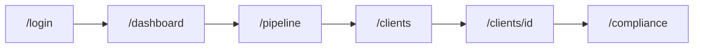
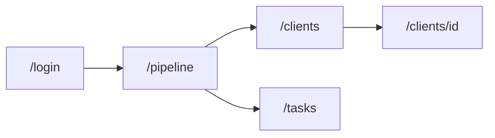
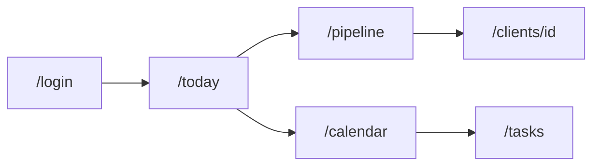

# Uspacy jako inspiracja — mapa ekranów CABPL CRM Demo

**Cel dokumentu:** mapowanie demo (Etap 1 / rozbudowa) na moduły **Uspacy** ([uspacy.pl](https://uspacy.pl/)) — per rola i per trasa — bez kopiowania UI ani pełnego zakresu produktu.

**Backlog implementacji:** wpisy dopisywane w [`demo-expansion.md`](./demo-expansion.md) → później user stories `US-xx`.

**Odbiorcy:** product, implementacja, prezentacja klientowi.

**Powiązane pliki:**

| Temat | Plik |
| --- | --- |
| Backlog rozbudowy | [`demo-expansion.md`](./demo-expansion.md) |
| Wymagania bazowe | [`requirements.md`](./requirements.md) §3, §6 |
| Mapa FS (pomocnicza) | [`fs-inspiration.md`](./fs-inspiration.md) |
| Nawigacja i role | [`ui-context.md`](./ui-context.md), [`lib/rbac/nav-items.ts`](../lib/rbac/nav-items.ts) |
| Wygląd (nie z Uspacy) | [`design-guide.md`](./design-guide.md) |
| Biznes BK | [`CABPL-CRM-notka.md`](./CABPL-CRM-notka.md) |

**Konta demo:** [`data/users.json`](../data/users.json) — wyloguj → `/login`.

---

## Czym jest Uspacy (kontekst)

**Jedna cyfrowa przestrzeń robocza:** CRM + zadania + współpraca + **centrum komunikacji** (czat, e-mail, kanały) + automatyzacja + analityka. Target: **MŚP**, SaaS, aplikacje mobilne/desktop, otwarte API.

**Dla CABPL demo bierzemy:** uporządkowanie procesów w jednym UI, **multi-lejki**, **aktywność** wokół klienta/deala, spotkania → zadania, analityka KPI.

**Świadomie nie bierzemy (Etap 1 demo):** omnichannel (WhatsApp, Instagram…), wewnętrzny czat firmowy, no-code platform, pełna automatyzacja workflow, hosting/compliance Uspacy zamiast narracji KNF CA.

---

## Legenda kolumn

| Kolumna | Znaczenie |
| --- | --- |
| **Trasa CABPL** | Route w aplikacji demo (stan na US-01–13) |
| **Uspacy (~)** | Moduł / koncept na uspacy.pl — orientacyjnie |
| **Req.** | [`requirements.md`](./requirements.md) |
| **Z Uspacy bierz** | IA, przepływ, funkcja do naśladowania |
| **Z Uspacy nie bierz** | Świadomie inaczej (bank, CA, zakres demo) |

---

## 1. Moduły Uspacy → moduły CABPL (mapa globalna)

| Uspacy (oferta) | CABPL demo dziś | Trasa / komponent | Uwagi rozbudowy (`demo-expansion`) |
| --- | --- | --- | --- |
| **CRM** (relacje, deale) | ✓ | `/pipeline`, `/clients`, `/leads` | Drawer szansy, produkt na szansie |
| **Analityka** | ✓ częściowo | `/dashboard` | Drill-down per doradca (menedżer) |
| **Współpraca / Zadania** | ✓ | `/tasks`, `/today` | Spotkanie → zadanie (Uspacy meeting notes) |
| **Aktywności** | ✓ częściowo | timeline na kliencie | **Activity hub** — jeden feed |
| **Centrum komunikacji** | ✗ | — | Tylko mock / compliance; e-mail w timeline |
| **Automatyzacja** | ✗ | NBA statyczne | Reguły, nie builder |
| **Multi-lejki w dealach** | ✗ | jeden lejek BK | Kandydat US-18+ |
| **Firma i ludzie** | ✓ | `/employees`, `/company-structure` | Kontakty klientów — `/contacts` stub |
| **Smart obiekty / no-code** | ✗ | — | Etap 2 / narracja |
| **Aplikacje mobilne** | ✗ | desktop-first | — |
| **Zgodność RODO** | narracja | `/compliance` | KNF + CA, nie kopia UA/RODO slajdu Uspacy |

---

## 2. Nawigacja sidebara (plan — EXP-001)

Docelowa struktura (inspiracja modułów Uspacy **Firma i ludzie** + **CRM** + **Analityka**): szczegóły w [`demo-expansion.md` — EXP-001](./demo-expansion.md#exp-001--sidebar-grupy-i-nowa-ia-nawigacji).

| Uspacy (koncepcja) | Pozycja CABPL (plan) |
| --- | --- |
| Firma i ludzie | Grupa **FIRMA I LUDZIE** → Pracownicy |
| Współpraca / zadania | **Zadania** (poza grupą) |
| CRM | Grupa **CRM I SPRZEDAŻ** → Leady, Deale, Kontakty, Firmy, Produkty |
| Analityka | **Analityka** (poza grupą) |
| Dzień pracy | **Dziś** (na górze) |

---

## 3. Mapa tras (stan aplikacji ↔ Uspacy)

| Trasa CABPL | Komponent | Uspacy (~) | Req. | RBAC |
| --- | --- | --- | --- | --- |
| `/login` | `LoginUserPicker` | Workspace / start | §5.3 | Wszyscy |
| `/dashboard` | `ExecutiveDashboard` | **Analityka** — prognozy, plany | §3.1 | `executive` |
| `/today` | `TodayView` | **Aktywności** + zadania na dziś | §4 | `advisor` |
| `/pipeline` | `PipelineBoard` | **CRM** — deale, **multi-lejki** (docelowo) | §3.2 | Wszystkie role, scope |
| `/clients` | `ClientsTable` | CRM — baza klientów | §3.3 | Scope |
| `/clients/[id]` | `ClientDetailView` | Karta klienta + aktywność | §3.3–3.5 | Scope |
| `/leads` | `LeadsTable` | CRM — leady | §3.3 | Scope |
| `/tasks` | Tasks table | **Współpraca** — zadania | §3.4 | Scope |
| `/calendar` | `CalendarWeekView` | **Aktywności** — spotkania | §3.4 | Scope |
| `/compliance` | `ComplianceView` | *(brak)* — **KNF CA** | §6 krok 5 | Wszyscy |

**Start po logowaniu** (`lib/auth/post-login-path.ts`):

| Rola | Start | Uspacy (~) | CABPL |
| --- | --- | --- | --- |
| `executive` | `/dashboard` | Analityka pierwsza | Priorytet zarządu BK |
| `regional_manager` | `/pipeline` | Lejek zespołu | Nadzór regionu |
| `advisor` | `/today` | Dzień pracy / zadania | Operacje dzienne |

---

## 4. Zakres danych per rola

Reguły: [`lib/rbac/scope.ts`](../lib/rbac/scope.ts).

| Rola | Demo user | Zakres | Uspacy (~) |
| --- | --- | --- | --- |
| Doradca | Anna, Piotr | `ownerId` | Moje deale / moje zadania |
| Menedżer regionu | Marek | `regionId` | Zespół / teren |
| Zarząd | Jan | cały bank | Raporty organizacji |

---

## 5. Członek Zarządu (`executive`)

**Konto:** Jan Zarząd (`user-jan`).

### 5.1 Ścieżka prezentacji

### 5.2 Mapa ekranów

| # | Trasa | Uspacy (~) | Z Uspacy bierz | Z Uspacy nie bierz |
| --- | --- | --- | --- | --- |
| 1 | `/dashboard` | Analityka, wizualizacja KPI | Filtry wymiarów; scenariusze forecast | Widgety MŚP, growth hacking |
| 2 | `/pipeline` | CRM — widok wszystkich dealów | Agregat portfela, karty deali | Multi-lejek bez sensu produktowego BK |
| 3 | `/clients` | CRM — lista | Segmentacja, opiekun | Pola B2C SaaS |
| 4 | `/clients/[id]` | Karta + historia | Jedna oś aktywności (docelowo) | Omnichannel inbox |
| 5 | `/compliance` | — | — | Zastępowanie KNF slajdem RODO Uspacy |

### 5.3 Rozbudowa pod Uspacy (kandydaty do `demo-expansion`)

- Porównanie **regionów** na dashboardzie (Analityka).
- **Activity hub** na karcie hero klienta (skrót dla zarządu).

---

## 6. Regionalny menedżer (`regional_manager`)

**Konto:** Marek Wiśniewski (`user-marek`). **Start:** `/pipeline`.

### 6.1 Ścieżka

### 6.2 Mapa ekranów

| # | Trasa | Uspacy (~) | Z Uspacy bierz | Z Uspacy nie bierz |
| --- | --- | --- | --- | --- |
| 1 | `/pipeline` | Lejek zespołu + KPI | Luka do planu; owner na karcie | Gamifikacja rankingu |
| 2 | `/clients` | CRM zespołu | Filtr po doradcy | — |
| 3 | `/tasks` | Zadania zespołu | Widok zespołu, termin | Automatyczne przypisanie AI |
| 4 | `/calendar` | Spotkania zespołu | Tydzień regionu | Sync Outlook |

### 6.3 Rozbudowa pod Uspacy

- **Tabela doradców** (plan / weighted / liczba szans) — Analityka + CRM.
- **Multi-lejek** filtrowany per region (np. pozyskanie vs cross-sell).

---

## 7. Doradca korporacyjny (`advisor`)

**Konta:** Anna, Piotr. **Start:** `/today`.

### 7.1 Ścieżka

### 7.2 Mapa ekranów

| # | Trasa | Uspacy (~) | Z Uspacy bierz | Z Uspacy nie bierz |
| --- | --- | --- | --- | --- |
| 1 | `/today` | Dzień pracy, powiadomienia | Zadania dziś + spotkanie + 1× NBA | Ściana widgetów |
| 2 | `/pipeline` | Moje deale, DnD | Multi-lejek (2 typy BK) | 10 pipelineów SaaS |
| 3 | `/clients/[id]` | Karta + **Meeting notes → zadania** | Szybkie akcje: call, spotkanie, notatka | Chat WhatsApp w karcie |
| 4 | `/leads` | Leady → deal | Konwersja + follow-up date | Lead scoring ML |
| 5 | `/calendar` | Planowanie | Quick add spotkanie | — |

### 7.3 Rozbudowa pod Uspacy

- Po zapisie spotkania: **propozycja zadań** (Uspacy: ustalenia → tasks).
- **Drawer szansy** z polami produkt / konkurent / notatka.

---

## 8. Wzorce Uspacy — priorytet na rozbudowę demo

| Wzorzec Uspacy | Opis | Gdzie w CABPL | Priorytet |
| --- | --- | --- | --- |
| **Activity hub** | Jedno okno: e-mail, spotkania, zadania, notatki | `/clients/[id]`, częściowo `/today` | P0 |
| **Multi-lejki w dealach** | Osobne lejki procesów sprzedaży | `/pipeline` — selector | P1 |
| **Meeting notes → tasks** | Ustalenia po spotkaniu | Dialog spotkania, karta klienta | P1 |
| **Centrum komunikacji** | Wszystkie kanały w jednym oknie | Tylko **mock** + timeline `email` | P2 (narracja) |
| **Automatyzacja procesów** | Workflow | `nba-rules.ts` rozszerzone | P1 |
| **Analityka zespołu** | KPI per członek zespołu | `/pipeline` lub `/dashboard` menedżer | P1 |
| **Smart obiekty** | Pola custom | Pola BK w seed (`productLine`, `riskClass`) | P1 |
| **Widget czatu www** | — | Won't do | — |

Szczegóły implementacji → wpisy **EXP-xxx** w [`demo-expansion.md`](./demo-expansion.md).

---

## 9. Karta klienta — docelowy układ (inspiracja Uspacy)

| Sekcja CABPL (plan) | Uspacy (~) | Stan US-13 |
| --- | --- | --- |
| Nagłówek + dane BK | CRM account | ✓ |
| Osoby kontaktowe | Ludzie / kontakty | ✗ → `contacts.json` |
| Aktywne szanse | Deale powiązane | ✓ |
| **Jedna oś aktywności** | Activity feed | Częściowo (osobny timeline) |
| NBA | Automatyzacja / insights | ✓ reguły statyczne |
| Produkty bankowe (readonly) | Custom objects | ✗ zapowiedź Etap 2 |

---

## 10. Czego nie kopiować z Uspacy

- [ ] Wygląd i branding Freshworks/Uspacy (zostaje **CA**).
- [ ] Omnichannel jako działająca integracja.
- [ ] Wewnętrzny czat zespołu jako moduł demo.
- [ ] No-code / marketplace aplikacji.
- [ ] Pozycjonowanie MŚP zamiast bankowości korporacyjnej i KNF.
- [ ] Zastąpienie `/compliance` marketingiem RODO z uspacy.pl.

---

## 11. Uspacy vs Freshsales (kiedy który dokument)

| Potrzeba | Dokument |
| --- | --- |
| **Jedna przestrzeń**, aktywność, multi-lejek, spotkanie→zadanie | **Ten plik** (`uspacy-inspiration.md`) |
| Klasyczny **deal sidebar**, raport sprzedaży SaaS | [`fs-inspiration.md`](./fs-inspiration.md) |
| Co wdrażamy i kiedy | [`demo-expansion.md`](./demo-expansion.md) |

---

## 12. Linki zewnętrzne (referencja)

- [uspacy.pl](https://uspacy.pl/) — produkt, moduły
- [Funkcje / CRM](https://uspacy.pl/features/) — opis modułów
- [Centrum komunikacji](https://uspacy.pl/features/communication-hub/) — świadomie poza zakresem demo

---

*Ostatnia aktualizacja: utworzenie mapy; szczegóły rozbudowy w `demo-expansion.md`.*
