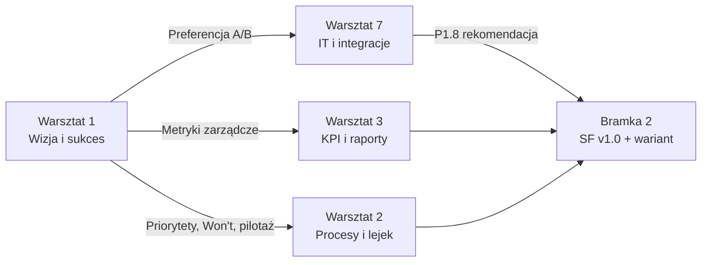

# Warsztat 1 — Wizja, cele i sukces projektu CRM

**Klient:** Credit Agricole Bank Polska S.A. — bankowość korporacyjna  
**Faza:** 1 — Odkrywanie wymagań (Discovery)  
**Numer warsztatu:** 1 z 7  
**Czas trwania:** 3 h (180 min)  
**Wersja scenariusza:** 1.0  
**Data opracowania:** 5 czerwca 2026 r.  
**Źródło:** [`plan-pracy-z-klientem.md`](./plan-pracy-z-klientem.md) §6.1, [`CABPL-CRM-notka.md`](./CABPL-CRM-notka.md)

---

## Spis treści

1. [Cel warsztatu](#1-cel-warsztatu)
2. [Warunki startu i kontekst](#2-warunki-startu-i-kontekst)
3. [Uczestnicy i role](#3-uczestnicy-i-role)
4. [Produkty wyjściowe](#4-produkty-wyjściowe)
5. [Przygotowanie przed warsztatem](#5-przygotowanie-przed-warsztatem)
6. [Materiały i narzędzia](#6-materiały-i-narzędzia)
7. [Agenda szczegółowa](#7-agenda-szczegółowa)
8. [Bloki merytoryczne — pytania i techniki facylitacji](#8-bloki-merytoryczne--pytania-i-techniki-facylitacji)
9. [Decyzje do podjęcia](#9-decyzje-do-podjęcia)
10. [Szablony do wypełnienia na sali](#10-szablony-do-wypełnienia-na-sali)
11. [Ryzyka facylitacji i plan B](#11-ryzyka-facylitacji-i-plan-b)
12. [Follow-up po warsztacie](#12-follow-up-po-warsztacie)
13. [Powiązanie z kolejnymi warsztatami](#13-powiązanie-z-kolejnymi-warsztatami)

---

## 1. Cel warsztatu

### 1.1 Cel główny

Uzgodnić **wspólną definicję sukcesu** projektu CRM Etapu 1 („Quick Win”) na poziomie Zarządu, biznesu i IT — zanim przejdziemy do mapowania procesów (Warsztat 2) i KPI (Warsztat 3).

### 1.2 Cele szczegółowe

| # | Cel | Jak zmierzymy na koniec 3 h |
| --- | --- | --- |
| C1 | Zdefiniować **sukces za 3 miesiące** vs **sukces za 5–6 miesięcy** | Tabela dwóch horyzontów czasowych wypełniona i zatwierdzona przez sponsora |
| C2 | Ustalić **metryki sukcesu** (adopcja, raport dla Zarządu, pilotaż) | Min. 5 wskaźników SMART z progiem akceptacji |
| C3 | Zdefiniować **zakres pilotażu** | Liczba regionów, użytkowników, kryteria wejścia/wyjścia z pilotażu |
| C4 | Uzyskać **wstępną odpowiedź biznesową** na wariant A vs B | Zapis preferencji + otwarte punkty do Warsztatu 7 i produktu P1.8 |
| C5 | Zamknąć **granice Etapu 1** — co świadomie odkładamy do Etapu 2 | Lista „Won't w Etapie 1” zatwierdzona przez Menedżera ds. CRM |

### 1.3 Czego warsztat **nie** robi

- Nie mapuje procesów lejka (→ Warsztat 2).
- Nie definiuje wskaźników KPI dashboardu (→ Warsztat 3).
- Nie podejmuje **wiążącej** decyzji technicznej A/B (→ Bramka 2, po specyfikacji).
- Nie szacuje kosztów ani harmonogramu implementacji (→ Faza 2–3).

---

## 2. Warunki startu i kontekst

### 2.1 Warunki wstępne

| Warunek | Status do potwierdzenia |
| --- | --- |
| Zakończona Faza 0 — prezentacja demo (08–19.06.2026) | ☐ |
| Dostępna notatka **P0.1** (feedback po demo) | ☐ |
| Rozdane **P0.2** (Etap 1 vs Etap 2) i **P0.3** (warianty A/B) | ☐ |
| Podpisany list intencyjny lub umowa ramowa na Fazę 1 | ☐ |
| Termin warsztatu zarezerwowany u wszystkich uczestników kluczowych | ☐ |

### 2.2 Kontekst biznesowy (do przypomnienia na otwarcie)

Z [`CABPL-CRM-notka.md`](./CABPL-CRM-notka.md):

| Driver | Skrót narracji na otwarcie (30 s) |
| --- | --- |
| Zacofanie technologiczne | Access i Excel nie skalują się na ~1500 klientów korporacyjnych |
| Zmiany personalne | Nowy Członek Zarządu oczekuje cyfryzacji i raportów; od 01.06 nowy Menedżer ds. CRM |
| Pilność | Oficjalny cel 3 miesięcy; realistycznie 5–6 miesięcy przy pełnym zakresie |
| Strategia dwuetapowa | Etap 1 Quick Win → Etap 2 Enterprise (360°, sprawy) |

### 2.3 Hipotezy z demo do walidacji (tylko na poziomie priorytetów)

Warsztat 1 **nie** wchodzi w szczegóły UX — potwierdzamy **kolejność priorytetów** widoczną w demo:

| Priorytet (hipoteza) | Pytanie walidacyjne |
| --- | --- |
| #1 Raportowanie zarządcze | Czy dashboard dla Zarządu jest warunkiem akceptacji go-live? |
| #2 Lejek sprzedażowy | Czy bez lejka pilotaż nie ma sensu biznesowego? |
| #3 Funkcje wspierające | Czy leady, zadania, kalendarz są „must” czy „should” w pierwszym wydaniu? |

---

## 3. Uczestnicy i role

### 3.1 Skład wymagany

| Rola | Osoba (do uzupełnienia) | Obecność | Odpowiedzialność na warsztacie |
| --- | --- | --- | --- |
| **Sponsor — Członek Zarządu** | | **Obowiązkowa** | Definicja sukcesu zarządczego; progi akceptacji KPI |
| **Menedżer ds. CRM** | | **Obowiązkowa** | Właściciel produktu; granice Etapu 1; definicja pilotażu |
| **Dyrektor IT ds. bankowości korporacyjnej** | | **Obowiązkowa** | Realność horyzontów; sygnał wstępny wariant A/B po stronie IT |
| **Lider biznesowy (wykonawca)** | | **Obowiązkowa** | Moderacja merytoryczna; dbałość o cele biznesowe |
| **Architekt rozwiązania (wykonawca)** | | **Obowiązkowa** | Tłumaczenie konsekwencji wariantów; granice techniczne Etapu 1 |
| **Kierownik projektu (wykonawca)** | | **Obowiązkowa** | Prowadzenie agendy, timekeeping, notatka, decyzje |
| **Analityk biznesowy (wykonawca)** | | Obecny (bez prezentacji) | Notowanie, uzupełnianie szablonów na żywo |

### 3.2 Skład opcjonalny (zaprosić, nie blokować warsztatu)

| Rola | Kiedy warto |
| --- | --- |
| Analityk biznesowy (bank) | Jeśli Menedżer ds. CRM chce od razu delegować szczegóły procesów |
| Controlling / planowanie finansowe | Jeśli plan sprzedażowy jest centralnym KPI sponsora |

### 3.3 Macierz RACI (uproszczona)

| Aktywność | Sponsor | Menedżer CRM | Dyrektor IT | Wykonawca |
| --- | --- | --- | --- | --- |
| Cele SMART Etapu 1 | **A** | R | C | C |
| Metryki sukcesu | **A** | R | I | C |
| Definicja pilotażu | C | **A** | C | R |
| Granice Etapu 1 / Won't | C | **A** | C | R |
| Preferencja wariant A/B | C | R | **A** (IT) / C (biznes) | R |

*A = accountable, R = responsible, C = consulted, I = informed*

---

## 4. Produkty wyjściowe

| ID | Produkt | Element wypełniany na W1 | Odbiorca |
| --- | --- | --- | --- |
| **P1.5** | Backlog priorytetyzowany (Must/Should/Could/Won't) | Szkic priorytetów wysokiego poziomu + lista Won't | Sponsor, Menedżer CRM |
| **P1.7** | Rejestr ryzyk i założeń | Pierwsze 5–10 pozycji (termin, wariant, adopcja) | KP + Sponsor |
| **P1.8** | Rekomendacja wariantu A vs B | Wstępna preferencja biznesowa + pytania otwarte do W7 | Dyrektor IT, Sponsor |
| **W1.1** | Notatka z warsztatu 1 | Pełny zapis decyzji i otwartych punktów | Wszyscy uczestnicy |
| **W1.2** | Karta sukcesu Etapu 1 | Cele SMART + metryki + pilotaż (1 strona) | Sponsor (podpis) |

---

## 5. Przygotowanie przed warsztatem

### 5.1 Wykonawca (do 3 dni roboczych przed W1)

| # | Zadanie | Odpowiedzialny |
| --- | --- | --- |
| 1 | Wysłać zaproszenie z agendą, celem i oczekiwanymi decyzjami | KP |
| 2 | Dołączyć **P0.1**, **P0.2**, **P0.3** oraz ten scenariusz (skrót 2 str.) | KP |
| 3 | Przygotować slajd otwarcia: „Dlaczego CRM teraz” (5 slajdów max) | Lider biznesowy |
| 4 | Przygotować slajd wariantów A/B (1 slajd — bez re-debaty całej sekcji 2 planu) | Architekt |
| 5 | Wydrukować / udostępnić szablony z [§10](#10-szablony-do-wypełnienia-na-sali) | Analityk |
| 6 | Zarezerwować salę z tablicą / Miro + projektor | KP |

### 5.2 Bank (pre-work — opcjonalnie, max 30 min pracy)

Króki formularz do wypełnienia przez Menedżera ds. CRM **przed** warsztatem:

1. Jak dziś mierzycie sukces sprzedaży w bankowości korporacyjnej? (1–3 metryki)
2. Ile osób realnie miałoby korzystać z CRM w pierwszym kwartale po uruchomieniu?
3. Co **musi** być gotowe, żeby Sponsor uznał projekt za udany?
4. Co **świadomie** może poczekać do Etapu 2?

### 5.3 Propozycja terminu

| Parametr | Wartość orientacyjna |
| --- | --- |
| Tydzień programu Fazy 1 | Tydzień 1 (np. 07–11.07.2026) |
| Dzień | Wtorek lub środa (unikać poniedziałku i piątku) |
| Godziny | 09:00–12:00 lub 13:00–16:00 |
| Przerwa | Po bloku 2 (~90 min) — 15 min |

---

## 6. Materiały i narzędzia

| Materiał | Format | Użycie |
| --- | --- | --- |
| Slajdy otwarcia (5) | PPT/PDF | Blok 1 |
| One-pager wariantów A/B (**P0.3**) | PDF | Blok 4 |
| One-pager Etap 1 vs 2 (**P0.2**) | PDF | Blok 3 |
| Tablica / Miro | Fizyczna lub cyfrowa | Wszystkie bloki — zapisy decyzji |
| Notatka P0.1 | PDF | Blok 1 — feedback z demo |
| Szablony §10 | Wydruk / Miro | Wypełnianie na bieżąco |
| Timer widoczny | Telefon / sala | Dyscyplina czasu |

---

## 7. Agenda szczegółowa

**Całkowity czas:** 180 min + 15 min przerwa = **195 min slot**

| Blok | Czas | Min | Temat | Prowadzący | Format |
| --- | --- | --- | --- | --- | --- |
| **0** | 0:00–0:10 | 10 | Otwarcie, reguły, cele dnia | KP | Plenum |
| **1** | 0:10–0:40 | 30 | Dlaczego CRM teraz — drivery i kontekst | Lider biznesowy | Prezentacja + Q&A |
| **2** | 0:40–1:10 | 30 | Oczekiwania Zarządu vs operacji | Sponsor + Menedżer CRM | Dyskusja facylitowana |
| — | 1:10–1:25 | 15 | **Przerwa** | | |
| **3** | 1:25–1:55 | 30 | Granice Etapu 1 — co odkładamy do Etapu 2 | Menedżer CRM | Ćwiczenie Must/Won't |
| **4** | 1:55–2:25 | 30 | Wariant A vs B — wstępna preferencja biznesowa | Architekt + Dyrektor IT | Prezentacja + dyskusja |
| **5** | 2:25–2:50 | 25 | Pilotaż, metryki sukcesu, SMART | KP + Lider biznesowy | Ćwiczenie na szablonie |
| **6** | 2:50–3:00 | 10 | Podsumowanie, decyzje, next steps | KP | Plenum |

---

### Blok 0 — Otwarcie (10 min)

**Prowadzący:** Kierownik projektu

**Script otwarcia (skrót):**

> „Celem dzisiejszych trzech godzin jest uzgodnienie, co znaczy **sukces** projektu CRM Etapu 1 dla Zarządu, biznesu i IT. Nie wchodzimy dziś w szczegóły lejka ani dashboardu — to Warsztaty 2 i 3. Wychodzimy z: celami SMART, definicją pilotażu, listą tego, co **świadomie** zostaje na Etap 2 oraz wstępną preferencją co do modelu wdrożenia (wariant A lub B). Decyzja wiążąca o wariancie zapadnie później — po warsztatach IT i specyfikacji.”

**Reguły pracy:**

1. Decyzje zapisujemy na tablicy w czasie rzeczywistym.
2. „Parking lot” na tematy procesowe (→ W2) i KPI (→ W3).
3. Sponsor ma **veto** na definicję sukcesu zarządczego.
4. Telefony na silent — wyjątek: oczekiwane escalations.

**Check-in round (opcjonalny, 2 min/os.):** „Jaki jest Twój jeden oczekiwany rezultat z dzisiejszego spotkania?”

---

### Blok 1 — Dlaczego CRM teraz (30 min)

**Prowadzący:** Lider biznesowy  
**Cel bloku:** Wspólne zrozumienie presji biznesowej i źródeł projektu.

**Agenda w bloku:**

| Min | Aktywność |
| --- | --- |
| 0–10 | Slajdy: Access, skala ~1500 klientów, oczekiwania Zarządu, dwuetapowość programu |
| 10–20 | Odniesienie do feedbacku z demo (**P0.1**): co zaskoczyło, czego brakowało |
| 20–30 | Pytania otwarte; zebranie 3–5 „bólów” na tablicę (input do P1.1 AS-IS) |

**Slajdy (max 5):**

1. Tytuł + uczestnicy + cel dnia  
2. Stan obecny: Access / Excel / brak jednego źródła prawdy  
3. Skala: ~1500 klientów, role (doradca, RM, Zarząd)  
4. Dwuetapowość: Quick Win (3–6 mies.) → Enterprise (360°, sprawy)  
5. Demo jako punkt wyjścia — **hipotezy**, nie umowa  

**Pytania facylitacyjne:**

- Co dziś **najbardziej boli** w codziennej pracy zespołu sprzedaży?
- Czy problem to brak narzędzia, brak danych, czy brak procesu?
- Co się stanie, jeśli za 12 miesięcy nadal pracujemy na Access?

**Output bloku:** Lista 3–5 bólów operacyjnych (fotografia tablicy → załącznik W1.1).

---

### Blok 2 — Oczekiwania Zarządu vs operacji (30 min)

**Prowadzący:** Lider biznesowy (facylitacja), głos: Sponsor + Menedżer CRM  
**Cel bloku:** Zbalansować „raport dla Zarządu” vs „lejek dla doradców”.

**Technika:** Dwa filary na tablicy — kolumna **Zarząd** | kolumna **Operacje**

| Min | Aktywność |
| --- | --- |
| 0–10 | Sponsor: „Co muszę widzieć w pierwszym miesiącu po uruchomieniu?” |
| 10–20 | Menedżer CRM: „Co musi robić doradca i RM, żeby to osiągnąć?” |
| 20–30 | Wspólne priorytetyzowanie: max 3 priorytety #1–#3 na Etap 1 |

**Pytania do Sponsora:**

- Czy wolicie Państwo **szybki raport z danych częściowych**, czy **pełniejszy raport później**?
- Jaki horyzont planu sprzedażowego jest obowiązkowy: kwartał, rok, rolling forecast?
- Czy akceptujecie uruchomienie w modelu pilotażowym bez od razu całego banku?

**Pytania do Menedżera CRM:**

- Co musi działać **dla doradcy w dniu 1**, żeby nie wrócił do Access?
- Ile % czasu doradcy dziś idzie na administrację vs sprzedaż?
- Kto będzie **właścicielem adopcji** po stronie banku?

**Output bloku:** Top 3 priorytety Etapu 1 (np. 1. Dashboard Zarządu, 2. Lejek RM/doradca, 3. Zadania i spotkania).

**Parking lot:** szczegóły KPI → Warsztat 3; etapy lejka → Warsztat 2.

---

### Blok 3 — Granice Etapu 1 (30 min)

**Prowadzący:** Menedżer ds. CRM (głos), facylitacja: KP  
**Cel bloku:** Świadoma lista **Won't** — zapobiega scope creep.

**Technika:** Ćwiczenie **MoSCoW wysokiego poziomu** na tablicy.

| Min | Aktywność |
| --- | --- |
| 0–5 | Prezentacja **P0.2** — przypomnienie zakresu Etap 1 vs Etap 2 z notatki |
| 5–20 | Burza: moduły/funkcje — Must / Should / Could / Won't |
| 20–30 | Walidacja Won't z Dyrektorem IT (realność 3 vs 6 mies.) |

**Propozycja listy startowej do dyskusji** (wykonawca przygotowuje naklejki / wpisy w Miro):

| Obszar | Etap 1 (do klasyfikacji) | Etap 2 (domyślnie Won't w E1) |
| --- | --- | --- |
| Raportowanie zarządcze | Dashboard, forecast, plan vs wykonanie | Zaawansowana analityka predykcyjna |
| Lejek sprzedażowy | Etapy, prawdopodobieństwo, widoki per rola | Lejek per produkt bankowy (jeśli złożony) |
| Klienci | Karta klienta lite, lista firm | Client 360° (produkty, limity, grupa kapitałowa) |
| Leady | Moduł leadów, konwersja | Automatyczne scoringi kampanii |
| Zadania i kalendarz | Podstawowy kalendarz, zadania | Integracja pełna z Exchange/Teams |
| Historia kontaktów | Oś czasu (ręcznie / import) | Wszystkie kanały banku real-time |
| Sprawy / reklamacje | — | Case Management |
| Next best action | Reguły statyczne (5–10) | ML / modele predykcyjne |
| Produkty | Słownik / katalog lite | Pełna synchronizacja z core |

**Pytania facylitacyjne:**

- Co byłoby **porażką projektu**, gdyby było w Etapie 1, a nie zadziałało?
- Co **musi** wejść do Etapu 2, bo inaczej architektura byłaby zła?
- Czy **historia wszystkich kanałów** w 3 miesiące to Must czy iluzja?

**Output bloku:** Szkic MoSCoW (min. 8 pozycji + min. 5 Won't) → wkład do **P1.5**.

---

### Blok 4 — Wariant A vs B — preferencja wstępna (30 min)

**Prowadzący:** Architekt rozwiązania + Dyrektor IT  
**Cel bloku:** Biznesowo zrozumieć konsekwencje wyboru; **nie** podpisywać umowy.

**Agenda w bloku:**

| Min | Aktywność |
| --- | --- |
| 0–10 | 1 slajd: wariant A (nakładka → wymiana) vs B (fundament → rozwój) |
| 10–20 | Dyskusja: czy bank akceptuje **likwidację** systemu z Etapu 1 za 12–24 mies.? |
| 20–30 | Zapis wstępnej preferencji + warunków (np. „B, jeśli go-live ≤6 mies.”) |

**Narracja architekta (skrypt 3 min):**

> „Demo pokazuje ten sam ekran w obu wariantach. Różnica jest **pod spodem**: w A budujemy narzędzie na okres przejściowy — szybciej i taniej, ale przy Etapie 2 **nowy system** i migracja. W B Etap 1 to **pierwsze wydanie platformy**, którą rozwijamy w Etapie 2 — dłuższy start, niższy koszt całego programu w perspektywie 3–5 lat. Rekomendacja wykonawcy: **wariant B**. Decyzja wiążąca po specyfikacji i ocenie integracji (Warsztat 7, Bramka 2).”

**Pytania do Dyrektora IT:**

- Czy IT jest gotowe na pełniejszy fundament (SSO, baza, audyt) w horyzoncie 5–6 miesięcy?
- Co jest **nie do negocjacji** z punktu widzenia KNF już w Etapie 1?
- Jakie integracje są warunkiem sensownego pilotażu?

**Pytania do Sponsora / Menedżera CRM:**

- Czy akceptujecie, że użytkownicy **uczą się systemu, który może zniknąć** (wariant A)?
- Co jest ważniejsze: **kwartał efektu** czy **jedna platforma na lata**?

**Output bloku:**

| Pole | Wartość |
| --- | --- |
| Wstępna preferencja | A / B / „B pod warunkiem…” |
| Warunki | (np. termin, budżet, integracje) |
| Otwarte do W7 | (lista pytań IT) |
| Zapis | „Decyzja wiążąca → Bramka 2” |

→ Wkład do **P1.8** (szkic).

---

### Blok 5 — Pilotaż, metryki, SMART (25 min)

**Prowadzący:** KP + Lider biznesowy  
**Cel bloku:** Konkretne, mierzalne cele z progiem akceptacji.

**Technika:** Wypełnienie **Karty sukcesu Etapu 1** (szablon §10.1).

**Agenda w bloku:**

| Min | Aktywność |
| --- | --- |
| 0–10 | Definicja pilotażu: regiony, liczba użytkowników, czas trwania |
| 10–20 | Metryki SMART — min. 5 wskaźników |
| 20–25 | Dwa horyzonty: sukces @3 mies. vs sukces @5–6 mies. |

**Pytania facylitacyjne:**

- Ilu doradców i ilu RM w pilotażu? Jeden region czy dwa?
- Po ilu tygodniach pilotażu oceniamy „go / no-go” do rozszerzenia?
- Jaki % aktywnych użytkowników tygodniowo = sukces adopcji?
- Jakie **3 raporty** Sponsor musi dostać w pierwszym miesiącu?
- Kto zatwierdza wyjście z pilotażu do szerszego roll-out?

**Propozycja metryk startowych (do negocjacji):**

| Metryka | Przykładowy próg | Źródło danych |
| --- | --- | --- |
| Aktywni użytkownicy tygodniowo | ≥ 80% uczestników pilotażu | Logi systemu |
| Deale w CRM vs Access | 100% nowych szans w CRM | Audyt procesu |
| Raport plan vs wykonanie | Dostępny dla Zarządu do D+5 miesiąca | Dashboard |
| Czas zamknięcia miesiąca sprzedażowego | Skrócenie o X% vs dziś | Ankieta RM |
| Satysfakcja użytkowników (pilotaż) | ≥ 4/5 po 4 tygodniach | Ankieta |

**Output bloku:** **W1.2 Karta sukcesu** — do podpisu mailowego Sponsora w ciągu 48 h.

---

### Blok 6 — Podsumowanie i next steps (10 min)

**Prowadzący:** Kierownik projektu

**Checklist odczytu decyzji (głośno, po kolei):**

1. ☐ Top 3 priorytety Etapu 1  
2. ☐ Min. 5 pozycji Won't (Etap 2)  
3. ☐ Wstępna preferencja wariant A/B + warunki  
4. ☐ Definicja pilotażu (regiony, N użytkowników, czas)  
5. ☐ Min. 5 metryk SMART  
6. ☐ Sukces @3 mies. vs @5–6 mies. — różnice zapisane  
7. ☐ Data Warsztatu 2 i oczekiwane materiały od banku  

**Next steps (standard):**

| Kiedy | Co | Kto |
| --- | --- | --- |
| D+1 | Notatka **W1.1** do akceptacji | KP |
| D+2 | Podpis **W1.2** (mail) | Sponsor |
| D+3 | Zaproszenie Warsztat 2 + prośba o zrzuty Access/Excel | KP |
| Tydzień 2 Fazy 1 | Warsztat 2 — procesy i lejek | Lider biznesowy |

---

## 8. Bloki merytoryczne — pytania i techniki facylitacji

### 8.1 Rejestr pytań otwartych zamykanych na W1

Z [`plan-pracy-z-klientem.md`](./plan-pracy-z-klientem.md) §13:

| ID | Pytanie | Jak zamykamy na W1 |
| --- | --- | --- |
| **Q4** | Wariant A vs B | Wstępna preferencja + warunki (decyzja wiążąca → Bramka 2) |
| **Q8** | Zakres pilotażu | Definicja pilotażu w Bloku 5 |

### 8.2 Pytania, które **świadomie odsuwamy**

| Temat | Dokąt | Powód |
| --- | --- | --- |
| Etapy lejka, reguły wygrana/przegrana | Warsztat 2 | Wymaga RM i doradców |
| Źródło planu sprzedażowego, KPI dashboardu | Warsztat 3 | Wymaga controllingu |
| Zakres kalendarza i karty klienta | Warsztat 4 | Wymaga szczegółowego modelu danych |
| Integracje, hosting, KNF | Warsztat 7 | Wymaga architektów i security |

### 8.3 Techniki facylitacji

| Technika | Kiedy stosować |
| --- | --- |
| **Timeboxing** | Każdy blok — twardy limit; „parking lot” zamiast wchodzenia w szczegóły |
| **Round-robin** | Blok 2 — każda strona (Zarząd / operacje) mówi równo |
| **Dot voting** (3 głosy/os.) | Priorytetyzacja MoSCoW w Bloku 3 |
| **5 Why** | Gdy ktoś proponuje Must — sprawdzić, czy to prawdziwy Must |
| **Decision record** | Każda decyzja: kto, co, kiedy, warunki |

---

## 9. Decyzje do podjęcia

Na koniec warsztatu **musi** istnieć zapis (tabela poniżej wypełniona):

| # | Decyzja | Opcje | Właściciel decyzji | Termin |
| --- | --- | --- | --- | --- |
| D1 | Top 3 priorytety Etapu 1 | Lista uporządkowana | Sponsor + Menedżer CRM | Dziś |
| D2 | Lista Won't Etapu 1 (min. 5) | Moduły/funkcje | Menedżer CRM | Dziś |
| D3 | Wstępna preferencja wariantu | A / B / B warunkowy | Sponsor + Dyrektor IT | Dziś (wiążąca → Bramka 2) |
| D4 | Definicja pilotażu | Regiony, N, czas | Menedżer CRM | Dziś |
| D5 | Metryki sukcesu SMART (min. 5) | Tabela metryk | Sponsor | Dziś + podpis W1.2 |
| D6 | Horyzont sukcesu | 3 mies. vs 5–6 mies. — co wchodzi kiedy | Sponsor | Dziś |
| D7 | Kryteria akceptacji go-live (biznesowe) | Lista bez technikaliów | Sponsor | Dziś |
| D8 | Termin Warsztatu 2 | Data | KP + Menedżer CRM | Dziś |

---

## 10. Szablony do wypełnienia na sali

### 10.1 Karta sukcesu Etapu 1 (W1.2)

```markdown
# Karta sukcesu — CRM Etap 1 Quick Win
Data warsztatu: _______________
Wersja: 1.0

## 1. Wizja (1 zdanie)
Po uruchomieniu Etapu 1 bankowości korporacyjnej _________________________________.

## 2. Top 3 priorytety
| # | Priorytet | Dlaczego |
|---|-----------|----------|
| 1 | | |
| 2 | | |
| 3 | | |

## 3. Sukces w dwóch horyzontach
| Horyzont | Co jest gotowe | Co świadomie nie jest |
|----------|----------------|------------------------|
| 3 miesiące (oficjalny cel klienta) | | |
| 5–6 miesięcy (realistyczny) | | |

## 4. Pilotaż
| Parametr | Wartość |
|----------|---------|
| Region(y) | |
| Liczba doradców | |
| Liczba RM | |
| Czas trwania pilotażu | |
| Kryterium wejścia | |
| Kryterium wyjścia (go/no-go) | |
| Data docelowa startu pilotażu | |

## 5. Metryki SMART
| ID | Metryka | Cel | Termin pomiaru | Właściciel |
|----|---------|-----|----------------|------------|
| M1 | | | | |
| M2 | | | | |
| M3 | | | | |
| M4 | | | | |
| M5 | | | | |

## 6. Kryteria akceptacji go-live (biznes)
- [ ] ...
- [ ] ...
- [ ] ...

## 7. Won't w Etapie 1 (min. 5)
1.
2.
3.
4.
5.

## 8. Wariant wdrożenia — wstępna preferencja
| Pole | Wartość |
|------|---------|
| Preferencja | ☐ A  ☐ B  ☐ B warunkowy |
| Warunki | |
| Decyzja wiążąca | Bramka 2 — ___.___.2026 |

## Podpisy
Sponsor (Członek Zarządu): _________________ Data: _______
Menedżer ds. CRM: _________________ Data: _______
Dyrektor IT BK: _________________ Data: _______
```

### 10.2 Parking lot (tablica boczna)

| Temat | Warsztat docelowy | Właściciel follow-up |
| --- | --- | --- |
| | W2 / W3 / W4 / W7 | |

### 10.3 Rejestr ryzyk — starter (P1.7)

| Ryzyko | Wpływ | Prawdop. | Mitigacja | Właściciel |
| --- | --- | --- | --- | --- |
| Termin 3 mies. nierealny przy wariancie B | Wysoki | Średnie | Uzgodniony horyzont 5–6 mies.; priorytetyzacja Must | Sponsor |
| Niska adopcja doradców | Wysoki | Średnie | Pilotaż, super-użytkownicy, szkolenia | Menedżer CRM |
| Brak integracji planu sprzedażowego | Średni | Wysokie | Warsztat 3 + W7; import ręczny w MVP | Dyrektor IT |
| Scope creep — Client 360° w Etapie 1 | Wysoki | Średnie | Lista Won't z W1 | Menedżer CRM |
| Decyzja A/B opóźniona | Średni | Niskie | P1.8 przed Fazą 2; Bramka 2 | KP |

---

## 11. Ryzyka facylitacji i plan B

| Ryzyko | Sygnał | Plan B |
| --- | --- | --- |
| Sponsor nie może być obecny | Brak potwierdzenia D-2 | **Przełożyć** W1 — bez Sponsora nie ma definicji sukcesu |
| Sponsor musi wyjść wcześniej | < 60 min obecności | Bloki 2 i 5 na początek; Blok 4 skrócony do 15 min |
| Spór A vs B zajmuje cały blok | Emocje, powtarzanie demo | Przypomnieć: wiążąca decyzja → Bramka 2; zapisać warunki obu stron |
| Menedżer CRM nie zna jeszcze organizacji | Nowa osoba od 01.06 | Więcej czasu na pre-work; Menedżer zapisuje „do uzupełnienia D+7” |
| Dyrektor IT blokuje wariant B (za wolno) | „Potrzebujemy za 3 mies.” | Tabela 3 vs 6 mies. w Bloku 5 — co wypada z Must przy 3 mies. |
| Rozjazd Zarząd vs operacje | Sprzeczne priorytety | KP facylituje: „co musi być w R1 pilotażu vs R4 dla Zarządu” |

---

## 12. Follow-up po warsztacie

### 12.1 Od wykonawcy (D+1 do D+3)

| Dzień | Działanie | Produkt |
| --- | --- | --- |
| D+1 | Wysłać notatkę W1.1 z decyzjami i zdjęciami tablic | W1.1 |
| D+1 | Zaktualizować szkic P1.5 (MoSCoW) i P1.7 (ryzyka) | P1.5, P1.7 |
| D+2 | Prośba o podpis mailowy W1.2 | W1.2 |
| D+3 | Zaproszenie W2 + lista materiałów od banku (zrzuty Access, raport RM) | — |

### 12.2 Od banku (D+7)

| Działanie | Odpowiedzialny |
| --- | --- |
| Podpis / uwagi do W1.2 | Sponsor |
| Wskazanie super-użytkowników na W2 (2–3 RM, 2–3 doradców) | Menedżer CRM |
| Dostarczenie przykładowego raportu miesięcznego RM | Menedżer CRM |

### 12.3 Kryterium „W1 zamknięty”

- [ ] W1.1 zaakceptowana bez uwag krytycznych  
- [ ] W1.2 podpisana przez Sponsora  
- [ ] Szkic P1.5 i P1.7 w repozytorium projektu  
- [ ] Warsztat 2 w kalendarzu z potwierdzonymi uczestnikami operacyjnymi  

---

## 13. Powiązanie z kolejnymi warsztatami



| Output W1 | Input do |
| --- | --- |
| Top 3 priorytety | Warsztat 2 — które procesy mapować pierwsze |
| Won't Etapu 1 | Warsztat 4 — granice karty klienta |
| Metryki Sponsora | Warsztat 3 — lista KPI obowiązkowych |
| Definicja pilotażu | Warsztat 6 — role i widoczność danych |
| Preferencja A/B | Warsztat 7 — integracje i hosting |

---

## Historia dokumentu

| Wersja | Data | Autor | Zmiany |
| --- | --- | --- | --- |
| 1.0 | 05.06.2026 | Marek Tomaszewski | Utworzenie scenariusza na podstawie plan-pracy-z-klientem.md |

---

## Załączniki (do przygotowania osobno)

- [ ] Slajdy otwarcia (5) — `warsztat-1-slajdy.pptx`
- [ ] Skrót scenariusza (2 str.) do wysyłki z zaproszeniem
- [ ] Formularz pre-work dla Menedżera ds. CRM
